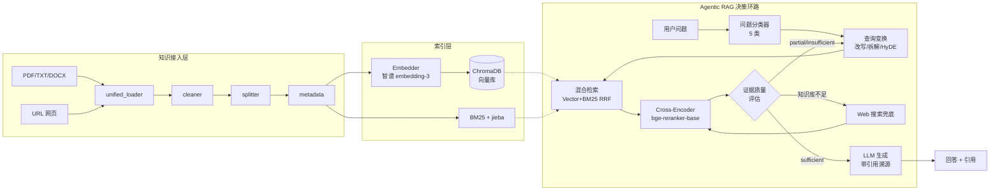

# 基于 RAG 的数据出境知识库问答系统

[](https://github.com/Melodymll01/riskpilot-cross-border-data-agent/actions/workflows/ci.yml)
[](https://github.com/Melodymll01/riskpilot-cross-border-data-agent/actions/workflows/ci.yml)
[](pyproject.toml)
[](.github/workflows/ci.yml)

一个面向数据出境法规、政策、指南场景的知识库问答系统。支持本地文档导入和网页内容采集，将多种来源的知识统一处理、向量化存储，实现基于检索增强生成（RAG）的智能问答。

## 关键指标

| 维度 | 数值 | 来源 |
| --- | --- | --- |
| Top-K=2 检索命中率 | **93.3%** | [chunk_eval_latest.json](evaluations/chunk_params/reports/chunk_eval_latest.json)（chunk_size=300, overlap=60） |
| Top-1 平均语义相似度 | **0.641** | 同上 |
| OOD 误杀率（in-domain） | **0.0%** | [ood_eval_latest.md](evaluations/ood/reports/ood_eval_latest.md) |
| OOD 召回率 | 66.7%（待改进，见下） | 同上 |
| 细分类型软标签准确率 | 70.0% | 同上 |

## 系统架构



## 功能特性

- **多源知识接入**：支持 PDF / TXT / DOCX 文件上传 + 网页 URL 采集
- **统一处理链路**：所有数据源经过同一条「加载 → 清洗 → 切分 → 向量化 → 入库」链路
- **混合检索**：向量检索 + BM25 + RRF 融合 + Cross-Encoder 重排序
- **Agentic RAG**：问题分类 → 查询变换（HyDE/拆解）→ 检索 → 证据评估 → 反思迭代（最多 3 轮）→ 联网兜底
- **RAG 问答**：基于检索结果生成回答，拒绝无据编造
- **引用溯源**：回答附带引用来源（文档名/网页标题、原文片段）
- **知识管理**：支持查看/删除已导入的知识来源

## 评测体系

项目内置三套评测，所有报告归档在 [evaluations/](evaluations/)：

1. **切块参数调优**（[chunk_params/run.py](evaluations/chunk_params/run.py)）—— 网格搜索 chunk_size × overlap，以命中率与 Top-1 相似度为指标，定型当前默认参数
2. **OOD 与细分类型分类**（[tests/eval_ood.py](tests/eval_ood.py)）—— 32 条样本（in-domain 20 + OOD 12），评估问题分类器的准召与软标签准确率
3. **端到端基准**（[benchmark/run.py](evaluations/benchmark/run.py)）—— 测量整链路延迟与回答质量

### 当前已识别的待改进项（坦诚记录，避免简历刷分式包装）

- **OOD 召回率 66.7% 未达自定目标 85%**：4 条 OOD 样本被误判为 in-domain（翻译、行程查询、邮件起草、跨法域对比），分类器对"借用领域关键词的非问答意图"识别不足。
  - 改进方向：① 在分类 prompt 中补充上述 bad case 作为 few-shot 反例；② OOD 探针检索阶段引入 distance + Top-K 一致性的联合判据，而非仅看 Top-1 distance。
- **细分类型严格准确率 55%（软标签 70%）**：`definition` 与 `condition` 经常互相混淆（如"法律定义"被误判为"条件触发"）。
  - 改进方向：拆解 prompt，将"问的是 *是什么* 还是 *什么情况下*"显式列为判别要点；考虑用小样本微调一个轻量分类头替代纯 prompt 路线。

## 项目结构

```
RagDataOut/
├── main.py                 # FastAPI 主入口（uvicorn main:app）
├── service.py              # 知识服务层（纯 Python，供 HTTP 与 Agent 复用）
├── config.py               # 全局配置（pydantic-settings，含启动期校验）
├── pyproject.toml          # 项目元数据 & 测试配置
├── requirements.txt        # Python 依赖
├── .env.example            # 环境变量模板（提交）
├── .env                    # 真实密钥（不提交，已在 .gitignore）
├── Dockerfile              # 多阶段构建，CPU 版镜像
├── .dockerignore           # 排除 venv / 数据 / .env 等
├── docker-compose.yml      # 一键启动（数据卷 + env_file）
├── LICENSE                 # MIT
├── api/                    # FastAPI 路由层
│   ├── routes.py
│   └── schemas.py          # 请求/响应模型
├── ingestion/              # 知识接入层（PDF/TXT/DOCX/URL）
│   ├── unified_loader.py
│   ├── file_loader.py
│   ├── pdf_extractor.py
│   └── web_loader.py
├── processing/             # 文档处理层
│   ├── cleaner.py
│   ├── splitter.py
│   └── metadata.py
├── retrieval/              # 检索 + 生成 + Agentic RAG
│   ├── search/             # embedder / vector_store / bm25 / fusion / reranker / retriever / query_rewriter
│   ├── generation/         # qa_chain / chat_client / report_generator
│   └── agent/              # agentic_rag / question_classifier / query_transformer / quality_grader / web_searcher
├── data/                   # 数据层（持久化，不提交内容）
│   ├── chat_db.py          # 聊天历史 SQLite 封装
│   ├── chroma_db/          # 向量库（运行时生成）
│   ├── embed_cache/        # embedding 缓存
│   └── uploads/            # 用户上传文件
├── evaluations/            # 评测脚本与报告
│   ├── benchmark/run.py    # 端到端性能基准
│   ├── chunk_params/run.py # 切块参数调优
│   └── ood/                # OOD 分类（脚本在 tests/eval_ood.py）
├── frontend/               # 单页前端
├── tests/                  # pytest 测试
└── logs/                   # 运行日志（不提交）
```

## 快速开始

> **两种启动方式任选其一：**
> - **A. Docker（推荐）**：一键启动，零环境配置
> - **B. 本地 Python**：适合需要调试源码的开发者

---

### 方式 A：Docker 启动（推荐）

> 前置：安装 [Docker Desktop](https://www.docker.com/products/docker-desktop/)（Windows 用户启用 WSL2 后端）。

```bash
# 1. 克隆仓库
git clone https://github.com/Melodymll01/riskpilot-cross-border-data-agent.git
cd riskpilot-cross-border-data-agent

# 2. 配置环境变量（仅需填一个 API Key）
copy .env.example .env       # Windows
# cp .env.example .env       # macOS / Linux
# 编辑 .env，填入 OPENAI_API_KEY

# 3. 一键启动（首次构建约 5-10 分钟，之后秒启）
docker compose up -d

# 4. 查看日志 / 停止 / 重启
docker compose logs -f
docker compose down
docker compose restart
```

启动后访问 <http://localhost:8001> 即可。

数据卷挂载说明：
- `./data` → 容器内 `/app/data`：向量库、上传文件、聊天历史持久化
- `./logs` → 容器内 `/app/logs`：运行日志
- `hf-cache`（Docker 命名卷）：HuggingFace 模型缓存，避免重复下载 reranker

> ⚠️ **密钥安全**：`.env` 仅在本机，**不会**被打进镜像。`.dockerignore` 已显式排除 `.env`，可放心 `docker push` 或分享镜像。

---

### 方式 B：本地 Python 启动

> **前置要求**：Python 3.10+、Git；如启用本地推理还需安装 [Ollama](https://ollama.com)。

#### 1. 克隆仓库

```bash
git clone https://github.com/Melodymll01/riskpilot-cross-border-data-agent.git
cd riskpilot-cross-border-data-agent
```

#### 2. 创建并激活虚拟环境

```bash
python -m venv .venv

# Windows (PowerShell)
.\.venv\Scripts\Activate.ps1

# macOS / Linux
source .venv/bin/activate
```

#### 3. 安装依赖

```bash
python -m pip install --upgrade pip
pip install -r requirements.txt
```

#### 4. 配置环境变量（必做）

```bash
copy .env.example .env       # Windows
# cp .env.example .env       # macOS / Linux
```

打开 `.env`，**至少填写以下两项**，其余保持默认即可：

```ini
OPENAI_API_KEY=<在智谱开放平台 https://open.bigmodel.cn 申请>
OPENAI_API_BASE=https://open.bigmodel.cn/api/paas/v4
```

完整示例（智谱 GLM 通道，与 `config.py` 默认值对齐）：

```ini
LLM_PROVIDER=api
EMBED_PROVIDER=api
OPENAI_API_KEY=your-key-here
OPENAI_API_BASE=https://open.bigmodel.cn/api/paas/v4
CHAT_MODEL=glm-4-flash
EMBEDDING_MODEL=embedding-3
CHUNK_SIZE=400
CHUNK_OVERLAP=80
TOP_K=5
```

> ⚠️ **安全提示**：`.env` 已在 `.gitignore` 中，**严禁** `git add .env`；提交前用 `git status` 二次确认。
> 如需切换到本地 Ollama 推理，将 `LLM_PROVIDER` / `EMBED_PROVIDER` 改为 `local`，并先执行 `ollama pull qwen2.5:7b && ollama pull nomic-embed-text`。

#### 5. （可选）运行测试，校验环境

```bash
pytest -q
```

#### 6. 启动服务

```bash
# 开发环境
uvicorn main:app --host 127.0.0.1 --port 8001 --reload

# 生产环境（去掉 --reload，按需调整 workers）
uvicorn main:app --host 0.0.0.0 --port 8001 --workers 2
```

#### 7. 访问系统

- 前端：<http://localhost:8001>
- Swagger API 文档：<http://localhost:8001/docs>

## 使用说明

### 导入知识

1. **上传文档**：在左侧面板点击上传区域或拖拽文件（支持 PDF/TXT/DOCX）
2. **采集网页**：在 URL 输入框粘贴网页地址，点击「采集」

### 知识问答

在右侧问答面板输入问题，点击「提问」或按 `Ctrl+Enter` 发送。系统将：

1. 在知识库中检索相关内容
2. 基于检索结果生成回答
3. 展示引用的来源和原文片段

### 知识管理

在「知识来源」面板可以查看已导入的所有来源及其文本块数量，支持按来源删除。

## API 文档

启动服务后访问 <http://localhost:8001/docs> 查看自动生成的 Swagger API 文档。


### 核心接口

| 方法 | 路径 | 说明 |
|------|------|------|
| POST | `/api/ingest/file` | 上传文件导入知识库 |
| POST | `/api/ingest/web` | 采集网页导入知识库 |
| POST | `/api/ask` | 知识库问答 |
| GET | `/api/sources` | 获取知识来源列表 |
| DELETE | `/api/sources/{name}` | 删除指定知识来源 |

## 扩展指南

### 更换 Reranker 模型

系统默认启用 Cross-Encoder 重排序（`BAAI/bge-reranker-base`，中文友好，首次启动会从 HuggingFace 下载约 1.1GB）。
如需更换，在 `.env` 中修改：

```ini
ENABLE_RERANKER=true                              # 关闭设为 false
RERANKER_MODEL=BAAI/bge-reranker-large            # 或 cross-encoder/ms-marco-MiniLM-L-6-v2（英文小模型，约 90MB）
RERANKER_DEVICE=auto                              # cuda / cpu / auto
RERANKER_SCORE_THRESHOLD=0.0                      # 分数阈值过滤
```

底层实现见 [retrieval/search/reranker.py](retrieval/search/reranker.py)，基于 `sentence-transformers` 的 `CrossEncoder`，可在该文件中扩展自定义重排序逻辑。

### 切换 Embedding / Chat 模型

在 `.env` 中修改 `EMBEDDING_MODEL` 和 `CHAT_MODEL`，配合修改 `OPENAI_API_BASE` 可对接任意 OpenAI 兼容接口（如本地部署的 Ollama、vLLM 等）。

## 技术栈

- **后端**：FastAPI + Pydantic
- **向量库**：ChromaDB
- **LLM**：OpenAI 兼容接口
- **文档解析**：PyPDF2 + python-docx
- **网页解析**：BeautifulSoup4
- **前端**：原生 HTML + CSS + JavaScript
