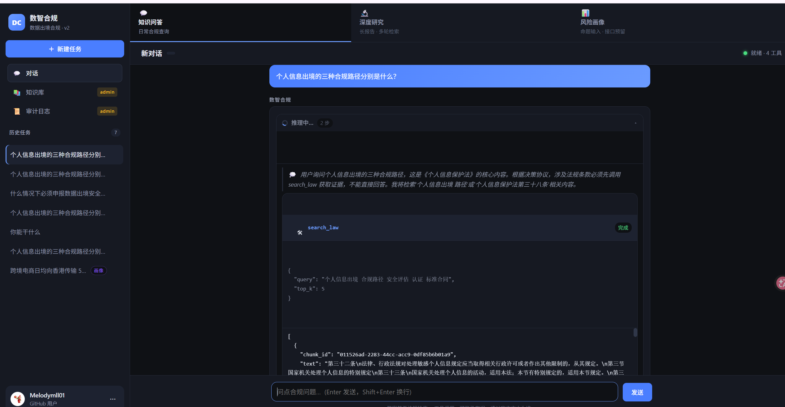
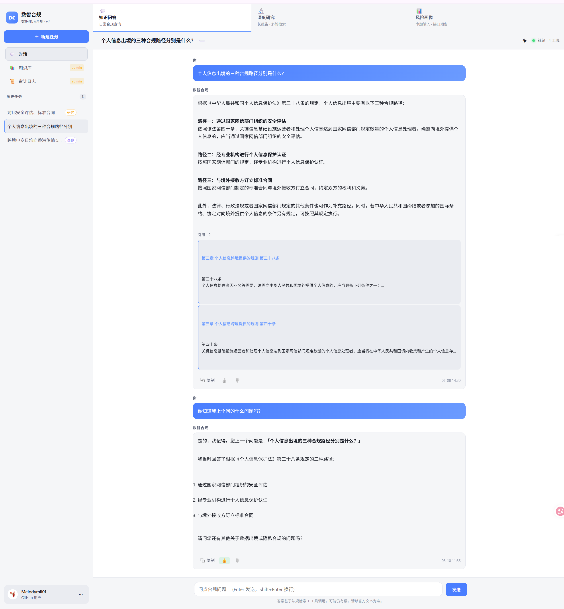
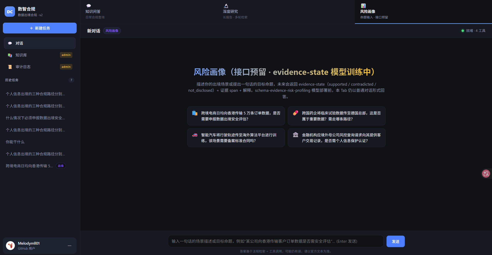
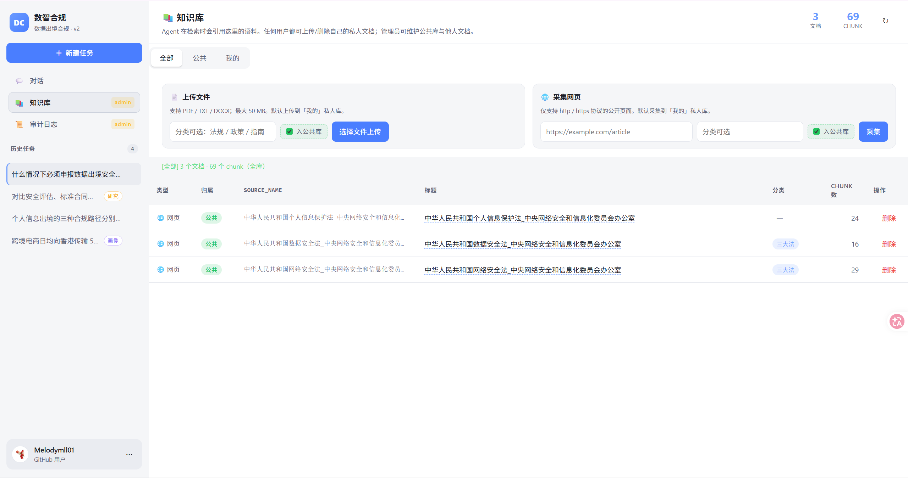
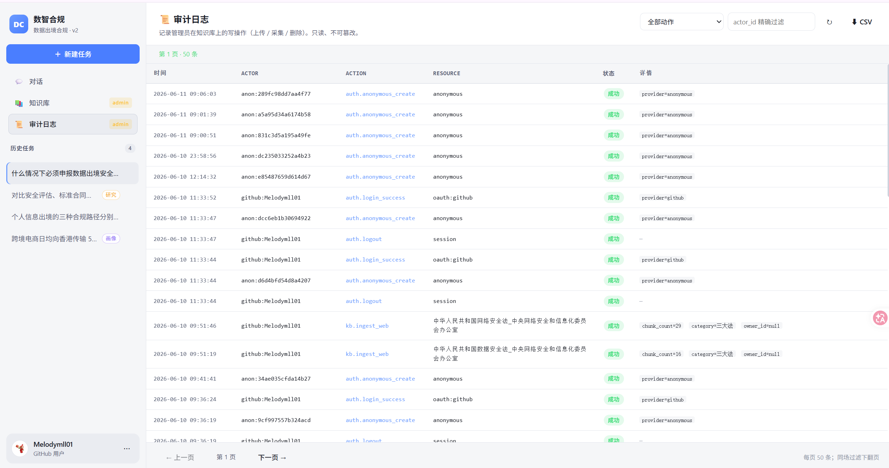
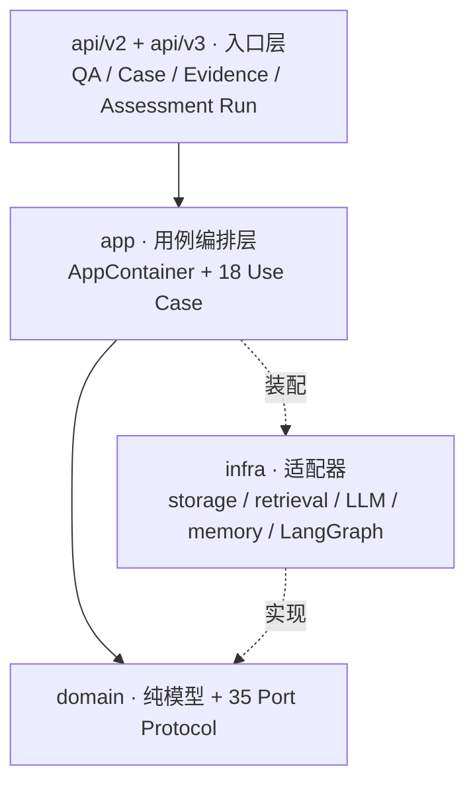
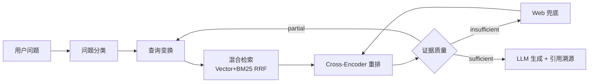

# RiskPilot · 数据出境合规案件智能体

[](https://github.com/Melodymll01/riskpilot-cross-border-data-agent/actions/workflows/ci.yml)
[](https://github.com/Melodymll01/riskpilot-cross-border-data-agent/actions/workflows/ci.yml)
[](pyproject.toml)
[](docs/architecture/overview.md)
[](app/agent/copilot.py)
[](infra/memory/)

> 面向**数据出境合规**场景的证据驱动案件工作台，内置以《个人信息保护法》《数据安全法》《网络安全法》及安全评估 / 标准合同 / 个保认证三路径为代表的法规知识库。
>
> 系统采用双路径：简单问答继续使用低成本自研 ReAct；案件评估使用 LangGraph，
> 将案件材料、confirmed facts、版本化规则、不可变 Assessment 和 Reviewer 审批串成
> 可暂停、恢复、重试、取消和审计的闭环。工程上保留 DDD 4 层与 Port 边界，
> `/api/v2` 和 `/api/v3` 增量并行。

---

## 产品速览

| 多步自主推理（ReAct 环路） | 带溯源引用的回答 |
| :---: | :---: |
|  |  |

| 三模式工作台 | 知识库治理（多租户） |
| :---: | :---: |
|  |  |

| 审计日记（可观测性） | |
| :---: | :---: |
|  | |

> 一键体验：`docker compose up -d`，访问 <http://localhost:8001>（见[快速开始](#快速开始)）。

---

## 核心能力

| 能力 | 实现 | 代码 |
| --- | --- | --- |
| **自主工具调用** | LLM 输出 JSON 决策协议，运行时分发到 4 工具：证据研判 / 法条库 / 用户私库 / Web 兜底 | [copilot.py](app/agent/copilot.py) |
| **多步推理 + 自反思** | 证据不足时回到查询变换重新检索，每步以 9 类 `AgentEvent` 流式推送，过程可观测 | [retrieval/agent/](retrieval/agent/) |
| **OOD 拦截** | 检索前做 5 类意图分类，域外问题直接拒答 | [question_classifier.py](retrieval/agent/question_classifier.py) |
| **查询变换** | 对模糊 / 复合问题做改写、拆解、HyDE | [query_transformer.py](retrieval/agent/query_transformer.py) |
| **证据分级** | 判定 sufficient / partial / insufficient，决定追检或兜底 | [quality_grader.py](retrieval/agent/quality_grader.py) |
| **4 层记忆 + 被遗忘权** | 最近消息 / 滚动摘要 / 用户画像 / 语义事实；支持单条删除与全量遗忘 | [infra/memory/](infra/memory/) |
| **答案可溯源** | 每条回答携带引用 chunk + 原文链接 | [retrieval/generation/](retrieval/generation/) |
| **案件级证据** | Workspace/Case/Document 隔离，原件、版本、页码、Chunk、事实引用可追溯 | [domain/documents.py](domain/documents.py) |
| **确定性合规评估** | 只消费 confirmed facts 的版本化规则引擎，生成 Finding、ActionItem 和不可变 Assessment | [domain/policy_engine.py](domain/policy_engine.py) |
| **可恢复案件工作流** | LangGraph + SQLite checkpointer，支持 interrupt/resume、失败重试、取消和人工审批 | [assessment_runs.py](app/use_cases/assessment_runs.py) |
| **V3 Evidence QA** | 四类授权检索；结构/语义双校验；有限 Claim 过滤修复，全部失败仍安全拒答 | [evidence_qa.py](app/use_cases/evidence_qa.py) |

## 关键指标

| 维度 | 数值 |
| --- | --- |
| 离线回归 | **1226 passed · 1 skipped · 1 个存量用例显式排除** |
| 架构规模 | **35 Port + 18 Use Case** · DDD 4 层 |
| V3 资源接口 | **41 个路由** · Workspace → Evidence QA / Assessment Run |
| Agent 工具 | **4 个领域工具** + 9 类流式 AgentEvent |
| 记忆系统 | **4 层**（L1 最近消息 → L4 语义事实） |
| Top-K=2 检索命中率 | **93.3%**（chunk_size=300, overlap=60） |
| OOD 误杀率（in-domain） | **0.0%** |

> 坦诚记录：OOD 召回率 66.7%、细分类型软标签准确率 70%，仍未达自定目标，改进方向见 [evaluations/ood/](evaluations/ood/)。

## 架构

依赖方向 `api → app → domain`，`infra` 反向实现 domain 端口；**domain 层不依赖任何框架**，保证可单元测试。详见 [docs/architecture/overview.md](docs/architecture/overview.md)。



### 双路径 AI 架构

- **V3 Evidence QA**：普通线性应用服务，不使用 LangGraph；先做授权范围检索，再生成
  原子 Claim，执行结构覆盖和独立语义支持校验，再以 `bounded_filter_v1` 只移除坏
  Claim；至少保留一条可信 Claim 时返回部分回答，否则安全拒答；
- **旧问答**：`/api/v2` 继续保留自研 ReAct，迁移期不做 Big Bang 删除；
- **Case Assessment**：通过 `WorkflowRuntimePort` 使用 LangGraph，领域层不依赖框架；
- **确定性边界**：LangGraph 负责流程状态，`PolicyRuleEngine` 负责门槛计算，
  `AssessmentManagementUseCase` 负责最终快照与审批；
- **检查点边界**：只保存对象 ID 和轻量状态，不保存文档正文、凭证、原始 prompt 或思维链。

### Agentic RAG 决策环路



## 4 层记忆系统

让智能体在多轮、跨会话中保持连贯，同时把隐私控制权交还用户（PIPL「被遗忘权」）。

| 层 | 作用 | 默认 | 设计 |
| --- | --- | :---: | --- |
| **L1 最近消息** | 短期上下文 | 恒开 | 滑动窗口，超出转 L2 |
| **L2 滚动摘要** | 长对话压缩 | 恒开 | 触发式摘要 + TTL 过期 |
| **L3 用户画像** | 稳定偏好 | 按需 | 结构化字段，跨任务复用 |
| **L4 语义事实** | 可检索长期事实 | 按需 | 抽取后去重合并 |

**被遗忘权**：可逐条删除长期事实（`DELETE /api/v2/memory/facts/{id}`，owner 隔离 + 物理删除 + 审计留痕）或一键全量遗忘。

## 工程亮点

- **DDD 4 层架构** + 35 Port Protocol + Container 依赖注入，domain 不依赖 FastAPI、
  LangGraph 或具体数据库
- **分层 AI 运行时**：V3 简单 QA 使用普通应用服务，V2 兼容问答保留自研 ReAct，
  Case Assessment 使用 `WorkflowRuntimePort + LangGraph`
- **可验证 Evidence QA**：LLM 只返回结构化 Claim；服务端重新读取当前文档版本原文，
  再用独立调用验证 Claim-Citation 语义支持；结果层只删除坏 Claim，不改写结论或
  补造引用，全部失败才拒答
- **可恢复人工闭环**：SQLite checkpointer + 产品 Run 乐观锁 + 连续事件 +
  Reviewer/Admin 审批
- **混合检索**：向量 + BM25 + RRF 融合 + Cross-Encoder 重排
- **全链路审计**：admin 写操作全部落审计日志，可合规追责
- **CI 守护**：GitHub Actions scoped ruff + pytest，每 push 自动跑

## 快速开始

### Docker（推荐）

```bash
git clone https://github.com/Melodymll01/riskpilot-cross-border-data-agent.git
cd riskpilot-cross-border-data-agent
copy .env.example .env          # 编辑 .env，填入 OPENAI_API_KEY
docker compose up -d
```

访问 <http://localhost:8001>。`.env` 不会打进镜像，可放心分享。

### 本地 Python

```bash
python -m venv .venv
.\.venv\Scripts\Activate.ps1     # macOS/Linux: source .venv/bin/activate
pip install -r requirements.txt
copy .env.example .env           # 至少填 OPENAI_API_KEY / OPENAI_API_BASE
uvicorn main:app --host 127.0.0.1 --port 8001 --reload
```

- 前端：<http://localhost:8001>　·　API 文档：<http://localhost:8001/docs>

最小 `.env`（智谱 GLM 通道，与 `config.py` 默认对齐）：

```ini
OPENAI_API_KEY=<在 https://open.bigmodel.cn 申请>
OPENAI_API_BASE=https://open.bigmodel.cn/api/paas/v4
CHAT_MODEL=glm-4-flash
EMBEDDING_MODEL=embedding-3
# 可选：GitHub OAuth + admin
ADMIN_USER_IDS=github:your-github-login
```

> `.env` 已在 `.gitignore`，**严禁** `git add .env`。

## 功能矩阵

| 能力 | 匿名 | 登录用户 | admin |
| --- | :---: | :---: | :---: |
| 对话问答 / 深度研究 / 风险画像 | ✅ | ✅ | ✅ |
| 任务历史持久化 | ✅ | ✅ | ✅ |
| 知识库查看 | ❌ | ✅ | ✅ |
| 知识库写入（上传 / 采集 / 删除） | ❌ | ❌ | ✅ |
| 审计日志 | ❌ | ❌ | ✅ |
| 长期记忆 / 被遗忘权 | ❌ | ✅ | ✅ |
| V3 案件材料 / 事实 / Assessment | 按 Workspace 成员关系 | ✅ | ✅ |
| 启动 / 继续 / 取消 Assessment Run | 按 Workspace 角色 | editor+ | ✅ |
| 确认关键事实 / 审批 Assessment | ❌ | reviewer | ✅ |

身份模型：匿名兜底 + GitHub OAuth（state 防 CSRF + JWT）+ admin 白名单（`ADMIN_USER_IDS`）。

## 主要 API（`/api/v2/*`）

| 方法 | 路径 | 权限 | 说明 |
| --- | --- | --- | --- |
| POST | `/copilot/chat/stream` | 登录 | **SSE 流式 + AgentEvent** |
| POST | `/copilot/chat` | 登录 | 同步聚合对话 |
| GET/PATCH/DELETE | `/tasks/*` | owner | 任务历史 CRUD |
| GET | `/documents` `/stats` `/{name}` | 登录 | KB 读取 |
| POST/DELETE | `/documents/file` `/web` `/{name}` | admin | KB 写入 / 删除 |
| GET | `/audit/logs` | admin | 审计日志查询 |
| GET | `/memory/facts` | owner | 长期事实清单 |
| DELETE | `/memory/facts/{id}` | owner | **删除单条事实（被遗忘权）** |
| POST | `/memory/forget` | owner | 级联遗忘 |

> v1 HTTP 层已退役。`/api/v2` 继续提供问答、研究、知识库和记忆能力；`/api/v3`
> 提供案件工作台能力。完整端点见 <http://localhost:8001/docs>。

## 案件工作台 API（`/api/v3/*`）

| 方法 | 路径 | 说明 |
| --- | --- | --- |
| POST/GET | `/workspaces` | Workspace 与成员权限 |
| POST/GET/PATCH | `/cases` | 合规案件和状态机 |
| POST/GET | `/cases/{case_id}/documents` | 案件材料、版本和处理任务 |
| GET | `/cases/{case_id}/evidence/search` | Case 范围混合检索 |
| POST/GET | `/cases/{case_id}/facts` | 事实候选、版本、证据和确认 |
| POST/GET | `/workspaces/{workspace_id}/policy-rules` | 版本化规则创建与发布 |
| POST/GET | `/cases/{case_id}/assessments` | 确定性 Assessment 生成与版本查询 |
| POST/GET | `/cases/{case_id}/assessment-runs` | LangGraph 案件评估运行 |
| POST | `/qa` | 四类授权语料范围的 Evidence QA |
| POST | `/runs/{run_id}/continue` | 重新检查材料/事实后恢复 |
| POST | `/runs/{run_id}/retry` | 重试 failed Run |
| POST | `/runs/{run_id}/cancel` | 幂等取消非终态 Run |
| POST | `/runs/{run_id}/review` | Reviewer/Admin 审批正式 Assessment |
| GET | `/runs/{run_id}/events` | 按 sequence 增量读取可审计事件 |

完整演示流程见：

- [V3 Evidence QA 指南](docs/guides/v3-evidence-qa.md)
- [V3 Case Assessment Run 指南](docs/guides/v3-assessment-run.md)

## 技术栈

- **后端**：FastAPI + Pydantic v2
- **架构**：DDD 4 层 + 35 Port + Container DI + WorkflowRuntimePort
- **工作流**：LangGraph 1.x + SQLite checkpointer + interrupt/resume
- **存储**：SQLite（业务对象 / Run / Event）+ 独立 LangGraph checkpoint SQLite + ChromaDB
- **鉴权**：GitHub OAuth + JWT（HS256）+ admin 白名单
- **LLM**：OpenAI 兼容接口（默认智谱 GLM，可换 Ollama / vLLM）
- **检索**：ChromaDB + jieba BM25 + RRF 融合 + bge-reranker-base 重排
- **记忆**：5 层分层记忆 + TTL + 语义事实去重 + 被遗忘权
- **前端**：原生 HTML + ES module（无构建依赖）
- **质量**：离线 pytest（1226 passed）+ ruff + GitHub Actions CI

## 文档

1. **V2 完整设计**：[docs/design/riskpilot-v2.md](docs/design/riskpilot-v2.md)
2. **架构全景**：[docs/architecture/overview.md](docs/architecture/overview.md)
3. **架构决策**：[docs/decisions/](docs/decisions/)
4. **迁移基线**：[docs/design/v2-migration-baseline.md](docs/design/v2-migration-baseline.md)
5. **Assessment Run 演示**：[docs/guides/v3-assessment-run.md](docs/guides/v3-assessment-run.md)
6. **Evidence QA 演示**：[docs/guides/v3-evidence-qa.md](docs/guides/v3-evidence-qa.md)

## 协议

[MIT](LICENSE)
