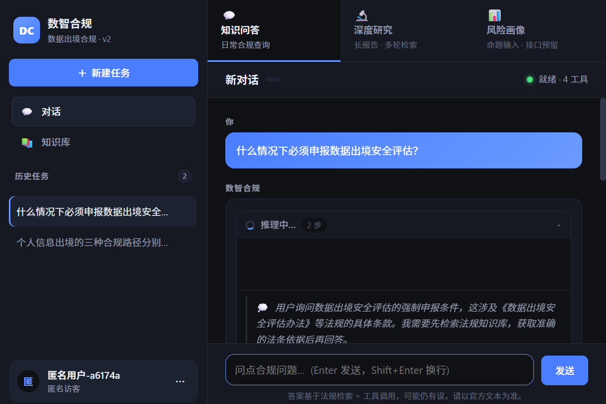
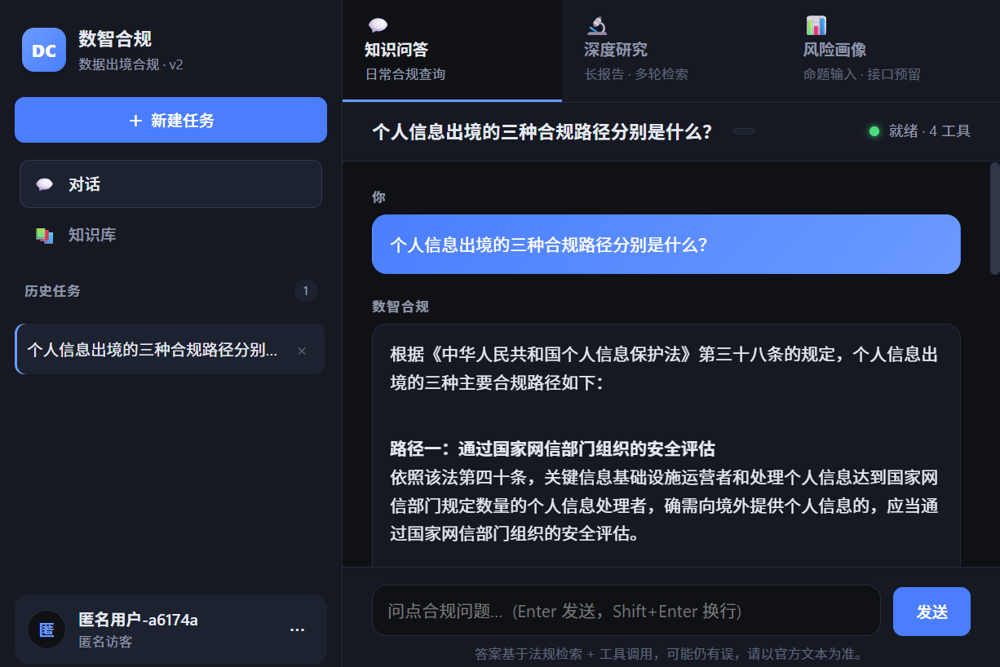
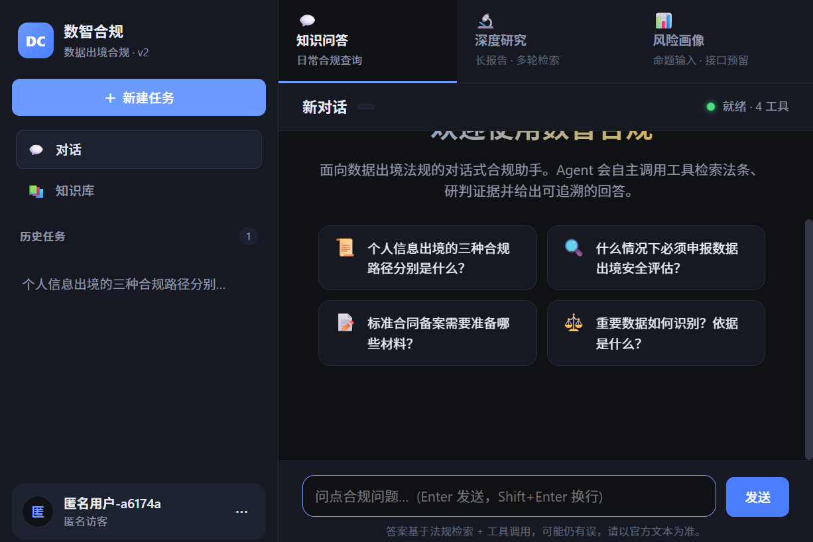
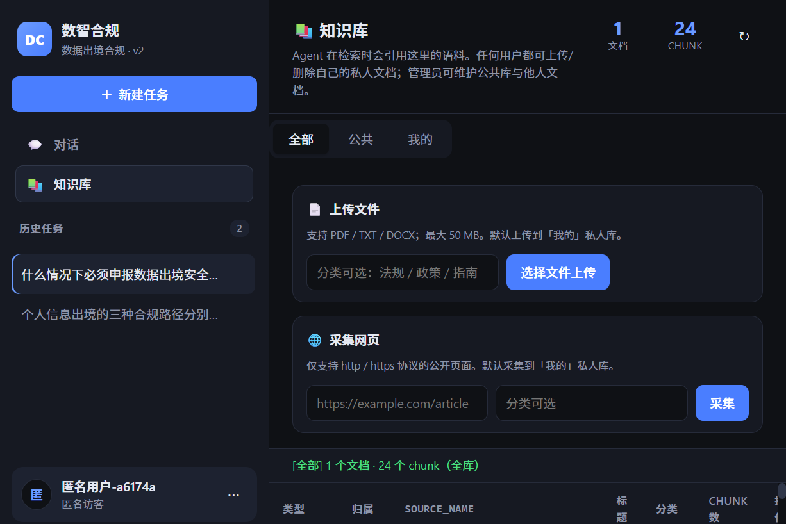
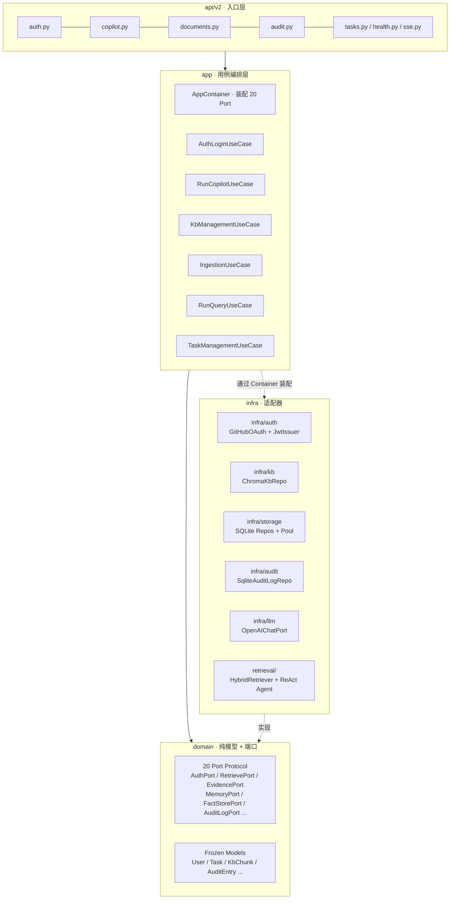
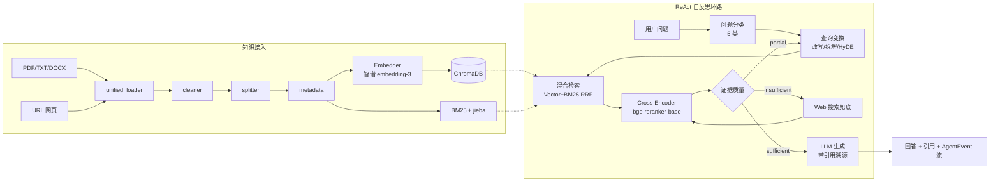
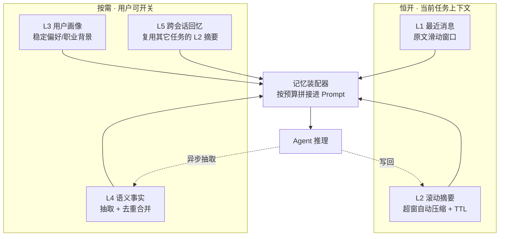

# 数智合规 · 基于 Agentic RAG 的数据出境合规智能体

[](https://github.com/Melodymll01/riskpilot-cross-border-data-agent/actions/workflows/ci.yml)
[](https://github.com/Melodymll01/riskpilot-cross-border-data-agent/actions/workflows/ci.yml)
[](pyproject.toml)
[](.github/workflows/ci.yml)
[](docs/architecture/overview.md)
[](retrieval/agent/agentic_rag.py)
[](infra/memory/)

> 一个**自主决策的合规领域智能体**：面向 **数据出境合规**（《个人信息保护法》《数据安全法》《网络安全法》三法 + 安全评估 / 标准合同 / 个保认证三路径）场景，Agent 会**自主分类问题 → 改写检索 → 调用工具取证 → 研判证据质量 → 多步追检 / Web 兜底 → 生成带溯源引用的回答**。
>
> 不依赖 LangChain，**纯 Python 自实现 ReAct 决策环路 + 4 个领域工具**；配套 **5 层记忆系统**（对齐 ChatGPT 的「当前上下文恒开 + 长期记忆按需 + 跨会话回忆按需 + 被遗忘权」）。工程上采用 **DDD 4 层架构（20 Port + 8 Use Case）**，791 个测试 + GitHub Actions CI 守护。

---

## 🎬 产品速览

| 多步自主推理（ReAct 决策环路） | 带溯源引用的结构化回答 |
| :---: | :---: |
|  |  |
| Agent 自主判断「先检索法条」，实时推送 `💭 思考` 与 `🛠 search_law` 工具调用，证据不足时自动追加第 2 轮检索 | 回答按合规路径结构化拆解，并附 **可点击溯源**（链接到 cac.gov.cn 原文条款） |

| 三模式工作台 · 4 工具就绪 | 知识库治理（多租户 · 公共/私人库） |
| :---: | :---: |
|  |  |
| 知识问答 / 深度研究 / 风险画像三种业务模式，顶栏实时显示 Agent 就绪状态与可用工具数 | 用户私人库 + 管理员公共库；上传 PDF/TXT/DOCX 或采集网页，写操作全程落审计日志 |

> 在线体验同款界面：克隆后 `docker compose up -d` 一键启动（见[快速开始](#快速开始)）。

---

## 🤖 作为「智能体」，它做了什么

| 能力维度 | 实现要点 | 代码位置 |
| --- | --- | --- |
| **自主工具调用** | LLM 输出 JSON 决策协议，运行时分发到 4 个工具：`evidence_judge`（证据研判）/ `search_law`（法条库）/ `search_user_docs`（用户私库）/ `web_search`（联网兜底） | [retrieval/agent/agentic_rag.py](retrieval/agent/agentic_rag.py) |
| **多步推理与自反思** | 单轮证据不足时回到查询变换重新检索，最多 N 轮；每步以 9 类 `AgentEvent` 流式推送给前端，过程完全可观测 | [retrieval/agent/](retrieval/agent/) |
| **问题分类 / OOD 拦截** | 进入检索前先做 5 类意图分类，域外问题（OOD）直接拒答，避免「一本正经地胡说」 | [retrieval/agent/question_classifier.py](retrieval/agent/question_classifier.py) |
| **查询变换** | 对模糊/复合问题做改写、拆解、HyDE 假设文档生成，提升召回 | [retrieval/agent/query_transformer.py](retrieval/agent/query_transformer.py) |
| **证据质量分级** | 检索后由 `quality_grader` 判定 sufficient / partial / insufficient，决定继续追检还是 Web 兜底 | [retrieval/agent/quality_grader.py](retrieval/agent/quality_grader.py) |
| **长期记忆 + 被遗忘权** | 5 层记忆（最近消息 / 滚动摘要 / 用户画像 / 语义事实 / 跨会话回忆），对齐 ChatGPT 交互；支持单条事实删除与全量遗忘 | [infra/memory/](infra/memory/) |
| **答案可溯源** | 每条回答携带引用 chunk + 原文链接，杜绝幻觉式断言 | [retrieval/generation/](retrieval/generation/) |

## 项目演进

```text
阶段一 · v1 原型              阶段二 · DDD 重构              阶段三 · 智能体增强
(Step 001-007)               (Step 008-029)                (Step 030-034)
────────────────             ─────────────────────────     ─────────────────────────
单体 service.py    ──┐       ┌─ DDD 4 层 domain/infra/      ┌─ 5 层记忆系统（L1-L5）
api/routes.py        │       │   app/api · 20 Port/8 UC     │   滚动摘要 + TTL
单一前端 HTML/JS     │  ───▶ │   GitHub OAuth + JWT + RBAC  │   语义事实抽取/去重
评测脚本             │       │   KB 管理面 + admin 审计      │   跨会话回忆（opt-in）
ChromaDB + BM25     │       │   GitHub Actions CI          │   被遗忘权（单条删除）
                     └───────┤   Strangler Fig 渐进迁移      └─ v1 API 全量退役（Step 029）
                             └─ 13 ADR 架构决策索引
```

## 关键指标

| 维度 | 数值 | 来源 |
| --- | --- | --- |
| 测试用例 | **791 passed · 1 skipped** | `pytest -q`（DDD 分层布局，覆盖 domain / app / infra / api） |
| 架构规模 | **20 Port + 8 Use Case** · 4 层 DDD | [docs/architecture/overview.md](docs/architecture/overview.md) |
| Agent 工具 | **4 个领域工具** + 9 类流式 AgentEvent | [retrieval/agent/agentic_rag.py](retrieval/agent/agentic_rag.py) |
| 记忆系统 | **5 层**（L1 最近消息 → L5 跨会话回忆） | [infra/memory/](infra/memory/) |
| 代码质量 | scoped ruff 0 errors | [.github/workflows/ci.yml](.github/workflows/ci.yml) |
| Top-K=2 检索命中率 | **93.3%** | [chunk_eval_latest.json](evaluations/chunk_params/reports/chunk_eval_latest.json)（chunk_size=300, overlap=60） |
| Top-1 平均语义相似度 | **0.641** | 同上 |
| OOD 误杀率（in-domain） | **0.0%** | [ood_eval_latest.md](evaluations/ood/reports/ood_eval_latest.md) |
| OOD 召回率 | 66.7%（待改进，见下） | 同上 |
| 细分类型软标签准确率 | 70.0% | 同上 |

## 系统架构

### 4 层 DDD 视图（v2，主推荐）



依赖方向：`api → app → domain`，`infra` 反向依赖 `domain`（端口实现）。**domain 层不依赖任何外部框架**，保证可单元测试。详见 [docs/architecture/overview.md](docs/architecture/overview.md)。

### Agentic RAG 决策环路



## 记忆系统（5 层 · 对齐 ChatGPT）

很多「Agent」只有单轮上下文。本项目实现了一套**分层记忆**，让智能体在多轮、跨会话中保持连贯，同时把**隐私控制权交还用户**（GDPR / PIPL 的「被遗忘权」）。



| 层 | 作用 | 默认 | 关键设计 |
| --- | --- | :---: | --- |
| **L1 最近消息** | 原文短期上下文 | 恒开 | 滑动窗口，超出转 L2 |
| **L2 滚动摘要** | 长对话压缩记忆 | 恒开 | 触发式摘要 + TTL 过期，控制 token 成本 |
| **L3 用户画像** | 稳定的身份/偏好 | 按需 | 结构化字段，跨任务复用 |
| **L4 语义事实** | 可检索的长期事实 | 按需 | 抽取后**去重合并**，避免记忆膨胀 |
| **L5 跨会话回忆** | 引用历史会话 | **默认关闭** | 复用其它任务的 L2 摘要（对齐 ChatGPT「引用历史聊天」的 opt-in 语义） |

**被遗忘权（Right to be Forgotten）**：用户可在「记忆与隐私」面板里**逐条删除**某条长期事实（`DELETE /api/v2/memory/facts/{id}`，owner 隔离 + 物理删除 + 审计留痕），或一键全量遗忘。开关项默认遵循「最小记忆」原则——只有用户主动打开，Agent 才会读写长期记忆。

> 设计取舍记录见 [docs/decisions/](docs/decisions/) 与 [docs/process/](docs/process/) 的对应 Step。

## 功能矩阵

| 能力 | 匿名用户 | 普通登录用户 | admin |
| --- | :---: | :---: | :---: |
| 对话式问答（QA 模式） | ✅ | ✅ | ✅ |
| 深度研究（多轮检索 + 长报告） | ✅ | ✅ | ✅ |
| 风险画像（接口预留） | ✅ | ✅ | ✅ |
| 任务历史持久化 | ✅（匿名 ID） | ✅（GitHub user_id） | ✅ |
| 知识库查看（list / stats / detail） | ❌ | ✅ | ✅ |
| 知识库写入（上传 / 采集 / 删除） | ❌ | ❌ | ✅ |
| 审计日志查看 | ❌ | ❌ | ✅ |
| 长期记忆 / 被遗忘权（记忆与隐私面板） | ❌ | ✅ | ✅ |
| SSE 流式输出 | ✅ | ✅ | ✅ |

身份模型：`AuthPort` 支持 **匿名兜底**（首访自动 POST `/auth/anonymous` 落 cookie）+ **GitHub OAuth**（state 防 CSRF + JWT 颁发）+ **admin 白名单**（`ADMIN_USER_IDS` 命中即 `is_admin=True`）。

## 工程亮点

- **DDD 4 层架构**：domain 纯 Python + 20 Port Protocol；infra 适配器；app 用例编排 + Container DI；api 入口（v2 单栈）
- **Strangler Fig 渐进重构**：v2 路由通过闭包 `build_*_routes(container)` 注入依赖，旧端点分阶段下线；至 Step 029 v1 HTTP 层（`service.py` / `api/routes.py` / `api/schemas.py`）已**整体退役**，现行接口全部在 `/api/v2/*`
- **审计副作用语义**：admin 在 KB 上的写操作（delete / ingest_file / ingest_web）成功失败都落 audit；audit 写失败仅 `logger.warning` 不影响主业务（[ADR-013](docs/decisions/ADR-013-audit-side-effect-semantics.md)）
- **自实现 ReAct Agent**：不依赖 LangChain，纯 Python + LLM JSON 决策协议；4 个领域工具 + 9 类 `AgentEvent` 流式推送给前端，推理过程完全可观测（[ADR-001](docs/decisions/ADR-001-no-langchain.md) / [ADR-011](docs/decisions/ADR-011-react-agent-self-implemented.md)）
- **5 层记忆系统**：最近消息 / 滚动摘要+TTL / 用户画像 / 语义事实去重 / 跨会话回忆；对齐 ChatGPT 的 opt-in 语义，内置**被遗忘权**（单条事实删除 + 审计留痕）
- **混合检索**：向量 + BM25 + **RRF 融合** + Cross-Encoder 重排序，4 级检索增强
- **CI 持续集成**：GitHub Actions 复活后 scoped ruff（14 路径）+ pytest 8 个 Fake 环境变量，每 push 自动跑

## 评测体系

项目内置三套评测，所有报告归档在 [evaluations/](evaluations/)：

1. **切块参数调优**（[chunk_params/run.py](evaluations/chunk_params/run.py)）—— 网格搜索 chunk_size × overlap，以命中率与 Top-1 相似度为指标，定型当前默认参数
2. **OOD 与细分类型分类**（[tests/eval_ood.py](tests/eval_ood.py)）—— 32 条样本（in-domain 20 + OOD 12），评估问题分类器的准召与软标签准确率
3. **端到端基准**（[benchmark/run.py](evaluations/benchmark/run.py)）—— 测量整链路延迟与回答质量

### 当前已识别的待改进项（坦诚记录，避免简历刷分式包装）

- **OOD 召回率 66.7% 未达自定目标 85%**：4 条 OOD 样本被误判为 in-domain（翻译、行程查询、邮件起草、跨法域对比），分类器对"借用领域关键词的非问答意图"识别不足。
  - 改进方向：① 在分类 prompt 中补充上述 bad case 作为 few-shot 反例；② OOD 探针检索阶段引入 distance + Top-K 一致性的联合判据，而非仅看 Top-1 distance。
- **细分类型严格准确率 55%（软标签 70%）**：`definition` 与 `condition` 经常互相混淆（如"法律定义"被误判为"条件触发"）。
  - 改进方向：拆解 prompt，将"问的是 *是什么* 还是 *什么情况下*"显式列为判别要点；考虑用小样本微调一个轻量分类头替代纯 prompt 路线。

## 项目结构

```
RagDataOut/
├── main.py                 # FastAPI 主入口（挂载 v2 路由 + 静态前端）
├── config.py               # 全局配置（pydantic-settings + 启动期校验）
├── pyproject.toml          # 项目元数据 & 测试/工具配置
├── requirements.txt        # 运行时依赖
├── requirements-dev.txt    # 开发依赖（ruff / mypy / pytest）
├── pytest.ini              # pytest 配置
├── Makefile                # 常用命令
├── .env.example            # 环境变量模板（提交）
├── .env                    # 真实密钥 + ADMIN_USER_IDS（不提交）
├── Dockerfile              # 多阶段构建
├── docker-compose.yml      # 一键启动
├── .github/workflows/      # CI 流水线（scoped ruff + pytest）
│
├── domain/                 # ★ 纯模型 + Port Protocol（不依赖任何框架）
│   ├── models.py           # User / Task / Message / KbChunk / AuditEntry / MemoryFact ...（frozen）
│   └── ports.py            # 20 个 Port Protocol（runtime_checkable）
│
├── app/                    # ★ 用例编排层
│   ├── container.py        # AppContainer · 装配所有 Port
│   ├── factories.py        # 各 Port 的默认 build_* 工厂
│   └── use_cases/          # 8 个 Use Case（AuthLogin / RunCopilot / KbManagement / MemorySettings / ForgetMemory ...）
│
├── infra/                  # ★ 适配器实现层
│   ├── auth/               # GitHubOAuth + JwtIssuer + FakeAuth（测试）
│   ├── kb/                 # ChromaKbRepo
│   ├── storage/            # SQLite Pool + User/Task Repo
│   ├── audit/              # SqliteAuditLogRepo
│   ├── llm/                # OpenAIChatPort 适配
│   ├── memory/             # task_memory / fact_store / consolidation / scheduler（L1-L5）
│   └── risk/               # RiskProfile Stub（接口预留）
│
├── api/v2/                 # ★ v2 入口层（auth / copilot / documents / audit / tasks / memory / sse / health）
│
├── retrieval/              # 检索 + 生成 + Agent
│   ├── search/             # embedder / vector_store / bm25 / fusion / reranker / retriever
│   ├── generation/         # qa_chain / chat_client / report_generator
│   └── agent/              # agentic_rag · ReAct 自实现 + 9 类 AgentEvent
│
├── ingestion/              # PDF/TXT/DOCX/URL 接入
├── processing/             # cleaner / splitter / metadata
│
├── frontend/               # 单页前端（ES module，无构建依赖）
│   ├── index.html
│   ├── app.js              # 入口 + view 切换（chat / kb / audit / 记忆与隐私）
│   ├── api.js              # /api/v2/* REST 客户端
│   ├── auth.js / chat.js / tasks.js / sse.js
│   ├── kb.js               # KB 管理面板（admin 写 / 用户读）
│   ├── settings.js         # 记忆与隐私面板（事实清单 / 开关 / 被遗忘权）
│   └── admin-audit.js      # 审计日志面板（admin-only）
│
├── data/                   # 运行时数据（不提交内容）
│   ├── chat_db.py          # 多表 SQLite 封装（user/task/message/kb/audit）
│   ├── chroma_db/          # 向量库
│   ├── embed_cache/        # embedding 缓存
│   └── uploads/            # 用户上传文件
│
├── evaluations/            # 评测脚本与报告
│   ├── benchmark/run.py    # 端到端基准
│   ├── chunk_params/run.py # 切块参数网格搜索
│   └── ood/                # OOD 分类评测（脚本在 tests/eval_ood.py）
│
├── tests/                  # pytest（791 passed · DDD 分层布局）
│   ├── domain/  app/  infra/  api/  fakes/
│   └── conftest.py
│
├── docs/                   # ★ 工程文档
│   ├── architecture/overview.md      # 4 层 + 20 Port 全景（推荐先读）
│   ├── decisions/                    # 13 个 ADR（架构决策记录）
│   └── process/                      # Step 001-034 演进日志（每个 Step 一篇）
│
└── logs/                   # 运行日志（不提交）
```

## 快速开始

> **两种启动方式任选其一：**
> - **A. Docker（推荐）**：一键启动，零环境配置
> - **B. 本地 Python**：适合需要调试源码的开发者

---

### 方式 A：Docker 启动（推荐）

> 前置：安装 [Docker Desktop](https://www.docker.com/products/docker-desktop/)（Windows 用户启用 WSL2 后端）。

```bash
# 1. 克隆仓库
git clone https://github.com/Melodymll01/riskpilot-cross-border-data-agent.git
cd riskpilot-cross-border-data-agent

# 2. 配置环境变量（仅需填一个 API Key）
copy .env.example .env       # Windows
# cp .env.example .env       # macOS / Linux
# 编辑 .env，填入 OPENAI_API_KEY

# 3. 一键启动（首次构建约 5-10 分钟，之后秒启）
docker compose up -d

# 4. 查看日志 / 停止 / 重启
docker compose logs -f
docker compose down
docker compose restart
```

启动后访问 <http://localhost:8001> 即可。

数据卷挂载说明：
- `./data` → 容器内 `/app/data`：向量库、上传文件、聊天历史持久化
- `./logs` → 容器内 `/app/logs`：运行日志
- `hf-cache`（Docker 命名卷）：HuggingFace 模型缓存，避免重复下载 reranker

> ⚠️ **密钥安全**：`.env` 仅在本机，**不会**被打进镜像。`.dockerignore` 已显式排除 `.env`，可放心 `docker push` 或分享镜像。

---

### 方式 B：本地 Python 启动

> **前置要求**：Python 3.10+、Git；如启用本地推理还需安装 [Ollama](https://ollama.com)。

#### 1. 克隆仓库

```bash
git clone https://github.com/Melodymll01/riskpilot-cross-border-data-agent.git
cd riskpilot-cross-border-data-agent
```

#### 2. 创建并激活虚拟环境

```bash
python -m venv .venv

# Windows (PowerShell)
.\.venv\Scripts\Activate.ps1

# macOS / Linux
source .venv/bin/activate
```

#### 3. 安装依赖

```bash
python -m pip install --upgrade pip
pip install -r requirements.txt
```

#### 4. 配置环境变量（必做）

```bash
copy .env.example .env       # Windows
# cp .env.example .env       # macOS / Linux
```

打开 `.env`，**至少填写以下两项**，其余保持默认即可：

```ini
OPENAI_API_KEY=<在智谱开放平台 https://open.bigmodel.cn 申请>
OPENAI_API_BASE=https://open.bigmodel.cn/api/paas/v4
```

完整示例（智谱 GLM 通道，与 `config.py` 默认值对齐）：

```ini
LLM_PROVIDER=api
EMBED_PROVIDER=api
OPENAI_API_KEY=your-key-here
OPENAI_API_BASE=https://open.bigmodel.cn/api/paas/v4
CHAT_MODEL=glm-4-flash
EMBEDDING_MODEL=embedding-3
CHUNK_SIZE=400
CHUNK_OVERLAP=80
TOP_K=5

# v2 鉴权（可选；不填则只能匿名 + 普通登录用户）
GITHUB_CLIENT_ID=<在 https://github.com/settings/developers 申请>
GITHUB_CLIENT_SECRET=<同上>
GITHUB_REDIRECT_URI=http://localhost:8765/api/v2/auth/github/callback
JWT_SECRET=<随机 32+ 字符>
ADMIN_USER_IDS=github:your-github-login     # 逗号分隔多个；命中即 is_admin=True
```

> ⚠️ **安全提示**：`.env` 已在 `.gitignore` 中，**严禁** `git add .env`；提交前用 `git status` 二次确认。`ADMIN_USER_IDS` 同时支持逗号分隔与 JSON 数组两种写法（见 [Step 018 文档](docs/process/step_018_login_bugfix_port_admin.md)）。

#### 5. （可选）运行测试，校验环境

```bash
pytest -q
```

#### 6. 启动服务

```bash
# 开发环境
uvicorn main:app --host 127.0.0.1 --port 8001 --reload

# 生产环境（去掉 --reload，按需调整 workers）
uvicorn main:app --host 0.0.0.0 --port 8001 --workers 2
```

#### 7. 访问系统

- 前端：<http://localhost:8001>
- Swagger API 文档：<http://localhost:8001/docs>

## 使用说明

### 身份与登录

- **首访自动匿名**：进入页面会自动 POST `/auth/anonymous` 落 cookie，可以直接开聊。
- **GitHub 登录**：点右下「使用 GitHub 登录」走 OAuth；登录后任务历史归到 GitHub user_id 名下。
- **admin 角色**：`.env` 的 `ADMIN_USER_IDS` 命中即 `is_admin=True`；侧栏出现 📚 知识库 + 📜 审计日志 两个新入口。

### 三种业务模式（顶部 Tab 切换，对话间不共享上下文）

1. **💬 知识问答**：日常合规查询，单轮检索 + 生成
2. **🔬 深度研究**：多轮检索 + 长报告，适合综述 / 对比 / 方案设计类问题
3. **📊 风险画像**：一句话命题 → 未来返回 evidence-state（接口已预留，模型部署前以普通对话形式回答）

### 知识库（登录用户可读，admin 可写）

- 在侧栏 📚 知识库 入口查看所有已入库文档（含 chunk 数、分类、来源类型）
- admin 额外可见上传 / 网页采集 / 删除按钮；普通用户看到只读 banner
- 写操作（delete / ingest_file / ingest_web）均落 audit_log（见下）

### 审计日志（admin-only）

- 侧栏 📜 审计日志 入口（admin 可见）
- 表格列：时间 / actor / action / resource / 状态徽章 / extra_json 摘要
- 支持按 action 下拉 + actor_id 输入框过滤；下方分页（50/页，offset 模式）

### 记忆与隐私（登录用户）

- 侧栏「记忆与隐私」面板：查看 Agent 记住的**长期事实**与**用户画像**
- 两个开关（默认遵循最小记忆）：**参考保存的记忆**、**参考会话上下文**（跨会话回忆，默认关闭）
- **被遗忘权**：逐条点 `×` 删除单条事实（owner 隔离 + 物理删除 + 审计留痕），或一键全量遗忘
- 匿名访客不显示该入口；登录后归属到 GitHub user_id

### Web 搜索兜底

当知识库证据不足且配置了搜索引擎 API 时，Agent 自动触发 Web 搜索补充检索；不依赖外部 API 也能跑（仅退化为知识库内回答 + 拒答信号）。

## API 文档

启动服务后访问 <http://localhost:8001/docs> 查看自动生成的 Swagger API 文档（含 v1 + v2 全量端点）。

### v2 端点（DDD 重构后的主推荐栈）

| 方法 | 路径 | 权限 | 说明 |
| --- | --- | --- | --- |
| POST | `/api/v2/auth/anonymous` | 公开 | 创建匿名 session（cookie） |
| GET | `/api/v2/auth/github/login` | 公开 | 拿 GitHub 授权 URL（含 state 防 CSRF） |
| GET | `/api/v2/auth/github/callback` | 公开 | OAuth 回调（302 回前端 + JWT cookie） |
| GET | `/api/v2/auth/me` | 公开 | 当前会话身份（含 `is_admin`） |
| POST | `/api/v2/auth/logout` | 公开 | 清 cookie |
| POST | `/api/v2/copilot/chat` | 登录 | 同步聚合对话 |
| GET | `/api/v2/copilot/stream` | 登录 | **SSE 流式 + AgentEvent** |
| GET / PATCH / DELETE | `/api/v2/tasks/*` | owner | 任务历史 CRUD（owner_id 隔离） |
| GET | `/api/v2/documents` `/stats` `/{name}` | 登录 | KB 读取（任意登录用户） |
| POST | `/api/v2/documents/file` `/web` | **admin** | KB 写入（上传 / 采集） |
| DELETE | `/api/v2/documents/{name}` | **admin** | KB 删除 |
| GET | `/api/v2/audit/logs` | **admin** | 审计日志查询（`limit/offset/action/actor_id` 过滤） |
| GET / PUT | `/api/v2/memory/settings` | owner | 记忆开关（参考保存的记忆 / 参考会话上下文，PUT 落同意审计） |
| GET | `/api/v2/memory/profile` | owner | L3 用户画像（稳定偏好） |
| GET | `/api/v2/memory/facts` | owner | 生效的长期事实清单（管理面板） |
| DELETE | `/api/v2/memory/facts/{id}` | owner | **删除单条事实（被遗忘权细粒度，204/404）** |
| POST | `/api/v2/memory/forget` | owner | 级联遗忘，返回各层删除计数 |
| GET | `/api/v2/health` `/health/ready` | 公开 | 健康检查 |

### v1 端点（已于 Step 029 全部退役删除）

v1 HTTP 层（`service.py` / `api/routes.py` / `api/schemas.py`）已整体删除，
现行接口全部在 `/api/v2/*`。下表为历史映射记录：

| 方法 | 路径 | 状态 | 替代 |
| --- | --- | --- | --- |
| ~~POST `/api/ask`~~ | ❌ Step 029 删除 | `/api/v2/copilot/chat` |
| ~~POST `/api/chat/sse`~~ | ❌ Step 029 删除 | `/api/v2/copilot/stream` |
| ~~POST `/api/retrieve`~~ | ❌ Step 029 删除 | `/api/v2/copilot/*` |
| ~~POST `/api/research`~~ | ❌ Step 029 删除 | `/api/v2/copilot/*`（`mode=research`） |
| ~~`/api/conversations*`~~ | ❌ Step 029 删除 | `/api/v2/tasks/*` |
| ~~GET `/health`~~ | ❌ Step 029 删除 | `/api/v2/health` |
| ~~POST `/api/ingest/file`~~ | ❌ Step 016d 删除 | `/api/v2/documents/file` |
| ~~POST `/api/ingest/web`~~ | ❌ Step 016d 删除 | `/api/v2/documents/web` |
| ~~GET `/api/sources`~~ | ❌ Step 016d 删除 | `/api/v2/documents` |
| ~~DELETE `/api/sources/{name}`~~ | ❌ Step 016d 删除 | `DELETE /api/v2/documents/{name}` |

## 扩展指南

### 更换 Reranker 模型

系统默认启用 Cross-Encoder 重排序（`BAAI/bge-reranker-base`，中文友好，首次启动会从 HuggingFace 下载约 1.1GB）。
如需更换，在 `.env` 中修改：

```ini
ENABLE_RERANKER=true                              # 关闭设为 false
RERANKER_MODEL=BAAI/bge-reranker-large            # 或 cross-encoder/ms-marco-MiniLM-L-6-v2（英文小模型，约 90MB）
RERANKER_DEVICE=auto                              # cuda / cpu / auto
RERANKER_SCORE_THRESHOLD=0.0                      # 分数阈值过滤
```

底层实现见 [retrieval/search/reranker.py](retrieval/search/reranker.py)，基于 `sentence-transformers` 的 `CrossEncoder`，可在该文件中扩展自定义重排序逻辑。

### 切换 Embedding / Chat 模型

在 `.env` 中修改 `EMBEDDING_MODEL` 和 `CHAT_MODEL`，配合修改 `OPENAI_API_BASE` 可对接任意 OpenAI 兼容接口（如本地部署的 Ollama、vLLM 等）。

## 技术栈

- **后端**：FastAPI + Pydantic v2 + pydantic-settings
- **架构**：DDD 4 层 + 20 Port Protocol + AppContainer 依赖注入
- **存储**：SQLite（user / task / message / audit / memory）+ ChromaDB（向量库）
- **鉴权**：GitHub OAuth + JWT（HS256）+ admin 白名单
- **LLM**：OpenAI 兼容接口（智谱 GLM 默认，可换 Ollama / vLLM）
- **检索**：ChromaDB（向量）+ jieba BM25 + RRF 融合 + bge-reranker-base 重排序
- **Agent**：自实现 ReAct + LLM JSON 决策协议 + 4 领域工具 + 9 类 AgentEvent
- **记忆**：5 层分层记忆（滚动摘要 + TTL + 语义事实去重 + 跨会话回忆 + 被遗忘权）
- **文档解析**：PyPDF2 + python-docx + BeautifulSoup4
- **前端**：原生 HTML + ES module + CSS（无构建依赖）
- **质量**：pytest（791 passed）+ ruff（scoped-clean）+ GitHub Actions CI

## 项目文档

工程文档全部在 [`docs/`](docs/) 下，建议按下面顺序阅读：

1. **架构全景**：[`docs/architecture/overview.md`](docs/architecture/overview.md) — 4 层 + 20 Port + 8 Use Case + 3 张时序图 + KB 权限矩阵 + CI 现状
2. **架构决策**：[`docs/decisions/`](docs/decisions/) — 13 个 ADR（含演化标记 Augmented-by）
   - [ADR-001 No LangChain](docs/decisions/ADR-001-no-langchain.md) · [ADR-006 4-layer Architecture](docs/decisions/ADR-006-4-layer-architecture.md) · [ADR-007 GitHub OAuth + Anonymous](docs/decisions/ADR-007-github-oauth-with-anonymous.md) · [ADR-008 Owner-ID Tenancy](docs/decisions/ADR-008-owner-id-tenancy.md)
   - [ADR-009 Closure Router + Container DI](docs/decisions/ADR-009-closure-router-container-di.md) · [ADR-010 Strangler Fig v1/v2](docs/decisions/ADR-010-strangler-fig-v1-v2.md) · [ADR-011 ReAct 自实现](docs/decisions/ADR-011-react-agent-self-implemented.md) · [ADR-012 Admin RBAC 白名单](docs/decisions/ADR-012-admin-rbac-allowlist.md) · [ADR-013 审计副作用语义](docs/decisions/ADR-013-audit-side-effect-semantics.md)
3. **演进日志**：[`docs/process/`](docs/process/) — Step 001-034 每步一篇，含改动清单 / 决策 / 验证 / 下一步候选

## 协议

[MIT](LICENSE)
