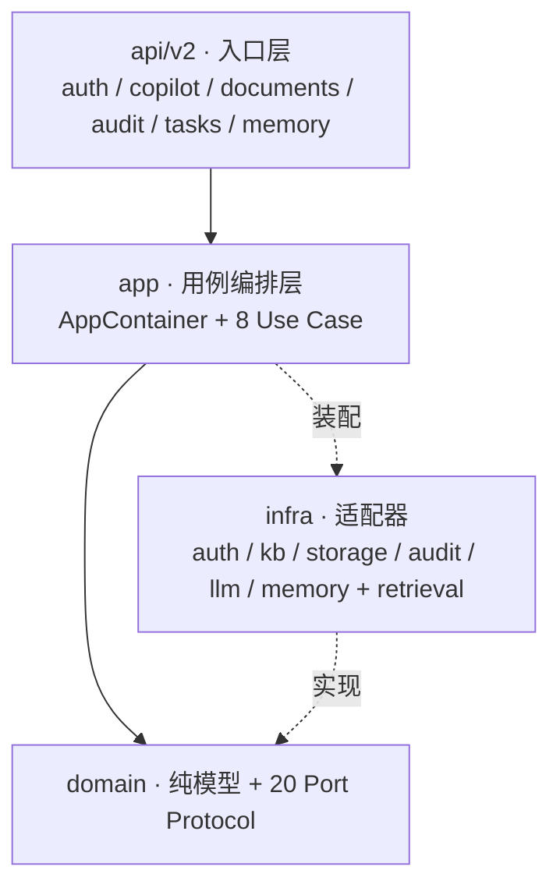
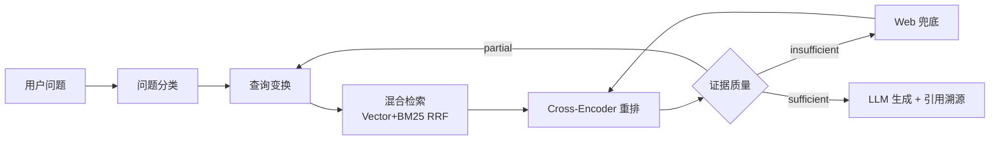

# 数智合规 · 数据出境合规 Agentic RAG 智能体

[](https://github.com/Melodymll01/riskpilot-cross-border-data-agent/actions/workflows/ci.yml)
[](https://github.com/Melodymll01/riskpilot-cross-border-data-agent/actions/workflows/ci.yml)
[](pyproject.toml)
[](docs/architecture/overview.md)
[](retrieval/agent/agentic_rag.py)
[](infra/memory/)

> 面向**数据出境合规**场景的领域智能体，内置以《个人信息保护法》《数据安全法》《网络安全法》及安全评估 / 标准合同 / 个保认证三路径为代表的法规知识库（可自行上传扩充任意 PDF/TXT/DOCX 或采集网页）。
>
> Agent **自主分类问题 → 改写检索 → 调用工具取证 → 研判证据 → 多步追检 / Web 兜底 → 生成带溯源引用的回答**。不依赖 LangChain，纯 Python 自实现 ReAct 环路 + 4 个领域工具，配套 4 层记忆系统。工程上采用 DDD 4 层架构，791 测试 + CI 守护。

---

## 产品速览

| 多步自主推理（ReAct 环路） | 带溯源引用的回答 |
| :---: | :---: |
|  |  |

| 三模式工作台 | 知识库治理（多租户） |
| :---: | :---: |
|  |  |

| 审计日记（可观测性） | |
| :---: | :---: |
|  | |

> 一键体验：`docker compose up -d`，访问 <http://localhost:8001>（见[快速开始](#快速开始)）。

---

## 核心能力

| 能力 | 实现 | 代码 |
| --- | --- | --- |
| **自主工具调用** | LLM 输出 JSON 决策协议，运行时分发到 4 工具：证据研判 / 法条库 / 用户私库 / Web 兜底 | [agentic_rag.py](retrieval/agent/agentic_rag.py) |
| **多步推理 + 自反思** | 证据不足时回到查询变换重新检索，每步以 9 类 `AgentEvent` 流式推送，过程可观测 | [retrieval/agent/](retrieval/agent/) |
| **OOD 拦截** | 检索前做 5 类意图分类，域外问题直接拒答 | [question_classifier.py](retrieval/agent/question_classifier.py) |
| **查询变换** | 对模糊 / 复合问题做改写、拆解、HyDE | [query_transformer.py](retrieval/agent/query_transformer.py) |
| **证据分级** | 判定 sufficient / partial / insufficient，决定追检或兜底 | [quality_grader.py](retrieval/agent/quality_grader.py) |
| **4 层记忆 + 被遗忘权** | 最近消息 / 滚动摘要 / 用户画像 / 语义事实；支持单条删除与全量遗忘 | [infra/memory/](infra/memory/) |
| **答案可溯源** | 每条回答携带引用 chunk + 原文链接 | [retrieval/generation/](retrieval/generation/) |

## 关键指标

| 维度 | 数值 |
| --- | --- |
| 测试用例 | **791 passed · 1 skipped** |
| 架构规模 | **20 Port + 8 Use Case** · DDD 4 层 |
| Agent 工具 | **4 个领域工具** + 9 类流式 AgentEvent |
| 记忆系统 | **4 层**（L1 最近消息 → L4 语义事实） |
| Top-K=2 检索命中率 | **93.3%**（chunk_size=300, overlap=60） |
| OOD 误杀率（in-domain） | **0.0%** |

> 坦诚记录：OOD 召回率 66.7%、细分类型软标签准确率 70%，仍未达自定目标，改进方向见 [evaluations/ood/](evaluations/ood/)。

## 架构

依赖方向 `api → app → domain`，`infra` 反向实现 domain 端口；**domain 层不依赖任何框架**，保证可单元测试。详见 [docs/architecture/overview.md](docs/architecture/overview.md)。



### Agentic RAG 决策环路



## 4 层记忆系统

让智能体在多轮、跨会话中保持连贯，同时把隐私控制权交还用户（PIPL「被遗忘权」）。

| 层 | 作用 | 默认 | 设计 |
| --- | --- | :---: | --- |
| **L1 最近消息** | 短期上下文 | 恒开 | 滑动窗口，超出转 L2 |
| **L2 滚动摘要** | 长对话压缩 | 恒开 | 触发式摘要 + TTL 过期 |
| **L3 用户画像** | 稳定偏好 | 按需 | 结构化字段，跨任务复用 |
| **L4 语义事实** | 可检索长期事实 | 按需 | 抽取后去重合并 |

**被遗忘权**：可逐条删除长期事实（`DELETE /api/v2/memory/facts/{id}`，owner 隔离 + 物理删除 + 审计留痕）或一键全量遗忘。

## 工程亮点

- **DDD 4 层架构** + 20 Port Protocol + Container 依赖注入，domain 纯 Python 可测
- **自实现 ReAct Agent**：不依赖 LangChain，LLM JSON 决策协议 + 4 工具 + 9 类流式事件
- **混合检索**：向量 + BM25 + RRF 融合 + Cross-Encoder 重排
- **全链路审计**：admin 写操作全部落审计日志，可合规追责
- **CI 守护**：GitHub Actions scoped ruff + pytest，每 push 自动跑

## 快速开始

### Docker（推荐）

```bash
git clone https://github.com/Melodymll01/riskpilot-cross-border-data-agent.git
cd riskpilot-cross-border-data-agent
copy .env.example .env          # 编辑 .env，填入 OPENAI_API_KEY
docker compose up -d
```

访问 <http://localhost:8001>。`.env` 不会打进镜像，可放心分享。

### 本地 Python

```bash
python -m venv .venv
.\.venv\Scripts\Activate.ps1     # macOS/Linux: source .venv/bin/activate
pip install -r requirements.txt
copy .env.example .env           # 至少填 OPENAI_API_KEY / OPENAI_API_BASE
uvicorn main:app --host 127.0.0.1 --port 8001 --reload
```

- 前端：<http://localhost:8001>　·　API 文档：<http://localhost:8001/docs>

最小 `.env`（智谱 GLM 通道，与 `config.py` 默认对齐）：

```ini
OPENAI_API_KEY=<在 https://open.bigmodel.cn 申请>
OPENAI_API_BASE=https://open.bigmodel.cn/api/paas/v4
CHAT_MODEL=glm-4-flash
EMBEDDING_MODEL=embedding-3
# 可选：GitHub OAuth + admin
ADMIN_USER_IDS=github:your-github-login
```

> `.env` 已在 `.gitignore`，**严禁** `git add .env`。

## 功能矩阵

| 能力 | 匿名 | 登录用户 | admin |
| --- | :---: | :---: | :---: |
| 对话问答 / 深度研究 / 风险画像 | ✅ | ✅ | ✅ |
| 任务历史持久化 | ✅ | ✅ | ✅ |
| 知识库查看 | ❌ | ✅ | ✅ |
| 知识库写入（上传 / 采集 / 删除） | ❌ | ❌ | ✅ |
| 审计日志 | ❌ | ❌ | ✅ |
| 长期记忆 / 被遗忘权 | ❌ | ✅ | ✅ |

身份模型：匿名兜底 + GitHub OAuth（state 防 CSRF + JWT）+ admin 白名单（`ADMIN_USER_IDS`）。

## 主要 API（`/api/v2/*`）

| 方法 | 路径 | 权限 | 说明 |
| --- | --- | --- | --- |
| GET | `/copilot/stream` | 登录 | **SSE 流式 + AgentEvent** |
| POST | `/copilot/chat` | 登录 | 同步聚合对话 |
| GET/PATCH/DELETE | `/tasks/*` | owner | 任务历史 CRUD |
| GET | `/documents` `/stats` `/{name}` | 登录 | KB 读取 |
| POST/DELETE | `/documents/file` `/web` `/{name}` | admin | KB 写入 / 删除 |
| GET | `/audit/logs` | admin | 审计日志查询 |
| GET | `/memory/facts` | owner | 长期事实清单 |
| DELETE | `/memory/facts/{id}` | owner | **删除单条事实（被遗忘权）** |
| POST | `/memory/forget` | owner | 级联遗忘 |

> v1 HTTP 层已于 Step 029 整体退役，现行接口全部在 `/api/v2/*`。完整端点见 <http://localhost:8001/docs>。

## 技术栈

- **后端**：FastAPI + Pydantic v2
- **架构**：DDD 4 层 + 20 Port + Container DI
- **存储**：SQLite（user/task/message/audit/memory）+ ChromaDB
- **鉴权**：GitHub OAuth + JWT（HS256）+ admin 白名单
- **LLM**：OpenAI 兼容接口（默认智谱 GLM，可换 Ollama / vLLM）
- **检索**：ChromaDB + jieba BM25 + RRF 融合 + bge-reranker-base 重排
- **记忆**：5 层分层记忆 + TTL + 语义事实去重 + 被遗忘权
- **前端**：原生 HTML + ES module（无构建依赖）
- **质量**：pytest（791 passed）+ ruff + GitHub Actions CI

## 文档

1. **架构全景**：[docs/architecture/overview.md](docs/architecture/overview.md)
2. **架构决策**：[docs/decisions/](docs/decisions/) — 13 个 ADR
3. **演进日志**：[docs/process/](docs/process/) — Step 001-034 每步一篇

## 协议

[MIT](LICENSE)
