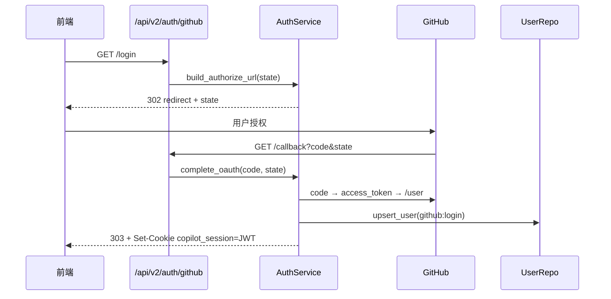
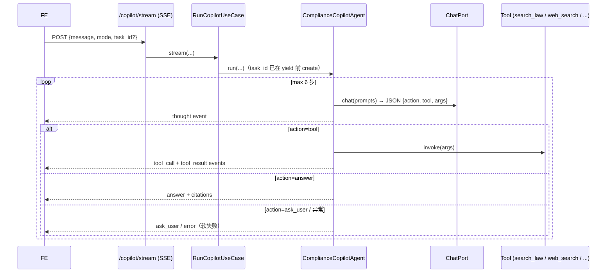
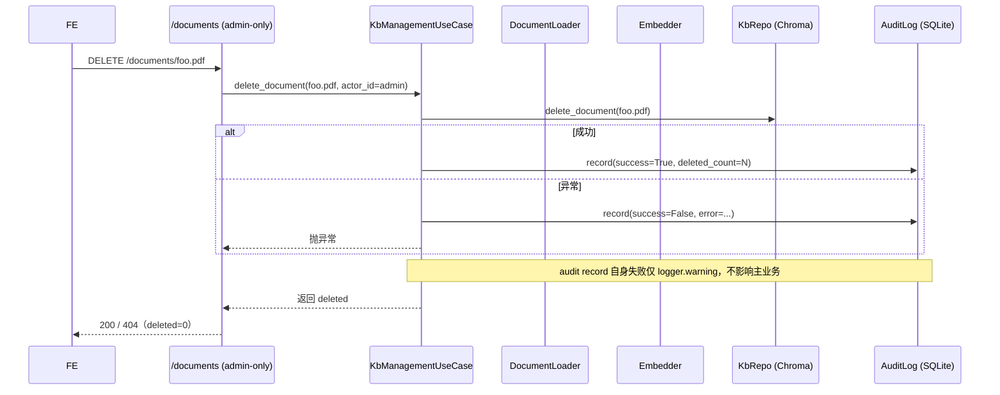

# 架构总览

> 本文档随实现演进而非冻结于 Step 001。当前对齐 Step 021（commit `f1f1824`，2026-06）。
> 详细历史设计见 [`../experiment_v1.md`](../experiment_v1.md)（v1.1 冻结稿，1283 行）。
> 每步演进过程见 [`../process/README.md`](../process/README.md) 索引表。

---

## 1. 一句话定位

数据出境合规 Copilot —— 对话式 Tool-Use Agent，集成自研 evidence-state LoRA 模型 + 混合检索 + 显式规则引擎 + Schema-guided 风险画像。

---

## 2. 项目演进轨迹

```
Step 001-007  设计冻结 + 工程基建 + 4 层架构落地 + Auth 层
Step 008-009  AppContainer 装配（DI）+ Agent ReAct 主循环
Step 010-012  api/v2 路由 + 前端 Copilot UI（Strangler Fig：v1/v2 共存）
Step 013-015  admin RBAC + Task.mode 三模式 + RiskProfilePort 接口预留
Step 016-019  KB 管理重构（Port + 先删后插）+ KB 权限拆分（读 login / 写 admin）
Step 020      GitHub Actions CI 复活（scoped ruff + pytest）
Step 021      Admin 操作审计日志（AuditLogPort + 副作用语义）
                                                        ← 当前位置
```

测试基线：**519 passed**（domain 60+ / infra 80+ / app 130+ / api 200+ / 其他 50+），CI 绿。

---

## 3. 4 层架构 + Closure DI

```
                                      ┌────────────────────┐
                                      │  外部服务（可换）   │
                                      ├────────────────────┤
                                      │ OpenAI/智谱/Ollama │
                                      │ Chroma · BM25       │
                                      │ Reranker bge        │
                                      │ vLLM Evidence-LoRA  │
                                      │ DuckDuckGo · GitHub │
                                      └─────────▲──────────┘
                                                │
┌─────────────────────────────────────┐  L1     │
│ infra/   (Adapter 实现 13 个 Port)  │ ───────┘
│   auth/  storage/  chat/  search/   │
│   web/   evidence/ kb/  audit/      │
│   risk_profile/                     │
└─────────▲────────────────────────────┘
          │  实现
┌─────────┴────────────────────────────┐  L2
│ domain/  (Port + Model + Error)      │
│   ports.py     13 个 Protocol         │
│   models.py    16 个 frozen 实体      │
│   errors.py    14 个 DomainError      │
│   零外部依赖、零 IO                  │
└─────────▲────────────────────────────┘
          │  依赖
┌─────────┴────────────────────────────┐  L3
│ app/                                 │
│   container.py  AppContainer (DI)    │
│   factories.py  build_<port>(...)    │
│   use_cases/    6 个 use case        │
│   agent/        ReAct 主循环 + Tools │
└─────────▲────────────────────────────┘
          │  闭包绑定
┌─────────┴────────────────────────────┐  L4
│ api/v2/  (Closure routers)           │
│   auth · tasks · documents · audit · │
│   copilot · health                   │
│   build_*_routes(container) 模式     │
│ api/     (legacy v1，待 Strangler)   │
└──────────────────────────────────────┘
```

### 依赖方向（强制）

- L4 → L3 ✅
- L3 → L2 ✅，**L3 ↛ L1 ❌**（只通过 Port）
- L2 ↛ 任何外部 ❌（必须纯 Python）
- L1 → L2 ✅（实现 Port）

CI 现在不强制 mypy（基线 ~46 errors，留独立 Step 清理），但 ruff scoped + 测试覆盖率充当事实上的约束。

---

## 4. 13 个 Port（按职责分组）

| 类别 | Port | 默认实现 | 用例 |
|---|---|---|---|
| **身份** | `AuthPort` | `AuthService`（GitHub OAuth + Anonymous + JWT） | 登录 / Cookie |
| **持久化** | `UserRepoPort` | `SqliteUserRepo` | 用户档案 |
| | `TaskRepoPort` | `SqliteTaskRepo`（`mode` 列幂等迁移） | 会话任务 |
| | `KbDocumentRepoPort` | `ChromaKbRepo`（先删后插幂等） | KB 文档 + chunks |
| | `AuditLogPort` | `SqliteAuditLogRepo`（双索引） | 操作流水 |
| **LLM/RAG** | `ChatPort` | `OpenAIChat`（兼容智谱 / Ollama） | 文本生成 |
| | `EmbedPort` | `Embedder` | 向量化 |
| | `RetrievePort` | `HybridRetriever`（BM25 + 向量 + RRF + bge rerank） | 检索 |
| | `WebSearchPort` | `DuckDuckGoSearch` | 联网搜索 |
| | `EvidencePort` | `MockEvidenceService` / 待接 vLLM | LoRA 证据判定 |
| | `RiskProfilePort` | `StubRiskProfileService` / 待接 LoRA | 风险画像 |
| **加载** | `DocumentLoaderPort` | `UnifiedLoader`（PDF/TXT/DOCX/Web） | 上传 / 抓取 |
| **记忆** | `MemoryPort` | （Step 022+ 接入） | 4 层记忆 |

> 13 = 1 (Auth) + 4 (持久化) + 6 (LLM/RAG) + 1 (加载) + 1 (记忆 占位)

每个 Port 都 `@runtime_checkable`，测试可用 `isinstance(fake, SomePort)` 直接验契约（见 `tests/infra/test_fakes.py`）。

---

## 5. 6 个 Use Case

| Use Case | 入口 | 端口依赖 |
|---|---|---|
| `AuthLoginUseCase` | `/api/v2/auth/*` | `AuthPort` |
| `TaskManagementUseCase` | `/api/v2/tasks/*` | `TaskRepoPort` |
| `IngestionUseCase` | （内部） | `EmbedPort` |
| `RunQueryUseCase` | `/api/v2/copilot/*` qa 旧路径 | `RetrievePort + ChatPort` |
| `RunCopilotUseCase` | `/api/v2/copilot/stream` | Agent + `RiskProfilePort`（profile 模式短路）|
| `KbManagementUseCase` | `/api/v2/documents/*` | `KbDocumentRepoPort + DocumentLoaderPort + EmbedPort + AuditLogPort?` |

---

## 6. 关键运行时序

### 6.1 GitHub OAuth 登录



### 6.2 Copilot ReAct 主循环（qa / research）



### 6.3 KB 写操作 + 审计副作用（Step 021）



---

## 7. 身份与权限模型

### 7.1 双轨身份

- 匿名：`owner_id = "anon:{uuid4}"`，前端 localStorage 持久化（向后兼容；Step 021 范围内私人 KB 隔离尚未上线）
- 登录：`owner_id = "github:{login}"`，httpOnly + samesite=lax JWT cookie，30 天

### 7.2 三段权限层级

| 角色 | gate | 用途 |
|---|---|---|
| 任意 | `make_require_owner` | 大多数读端点（401 未登录） |
| 登录用户 | `make_require_owner` | 自己的 task / kb 读 |
| **admin** | `make_require_admin` | KB 写 / 审计读（401 未登录 / 403 非 admin） |

admin 通过 `Settings.admin_user_ids: list[str]` 白名单声明（兼容 CSV 与 JSON 数组两种 .env 写法，见 ADR-012）。

### 7.3 KB 权限矩阵（Step 019）

| 端点 | 未登录 | 登录非 admin | admin |
|---|---|---|---|
| `GET /documents` | 401 | 200 | 200 |
| `GET /documents/stats` | 401 | 200 | 200 |
| `GET /documents/{name}` | 401 | 200 | 200 |
| `POST /documents/file` | 401 | 403 | 200 |
| `POST /documents/web` | 401 | 403 | 200 |
| `DELETE /documents/{name}` | 401 | 403 | 200 |
| `GET /audit/logs` | 401 | 403 | 200 |

---

## 8. 测试与 CI 策略

### 8.1 测试金字塔

```
                ┌──────────────────┐
                │ api  ~200 用例    │ FastAPI TestClient + 全 Fake 注入
                ├──────────────────┤
                │ app  ~130 用例    │ use case + agent + container
                ├──────────────────┤
                │ infra  ~80 用例   │ 适配器集成（tmp SQLite / responses）
                ├──────────────────┤
                │ domain  ~60 用例  │ frozen + extra=forbid + JSON
                └──────────────────┘
                  + 老 v1 烟雾  ~50
                合计 519 passed
```

### 8.2 Fake 设计原则

- 每个 Port 都有 `Fake*` 实现在 `tests/fakes/`，与适配器同语义
- Fake 都通过 `isinstance(fake, Port)` 契约校验（`tests/infra/test_fakes.py`）
- Container fixture 一次性注入全 Fake（`tests/api/conftest.py`），HTTP 测试无任何外部 IO

### 8.3 CI（Step 020 起）

```yaml
on: [push:main, PR:main, workflow_dispatch]

jobs:
  lint: ruff check <14 个 scoped 路径>
  test: pytest -q --ignore=eval_ood --ignore=smoke_bm25_rrf
       + 8 个假凭据环境变量
```

**未启用**：mypy（~46 基线 errors）、ruff format check（33 文件待 reformat）—— 留独立 Step 处理。

---

## 9. 决策追踪（ADR 索引）

| ADR | 决策 | 状态 |
|---|---|---|
| [ADR-001](../decisions/ADR-001-no-langchain.md) | 不用 LangChain，自实现编排 | accepted |
| [ADR-002](../decisions/ADR-002-bm25-rrf-fusion.md) | BM25 + 向量 + RRF + bge rerank | accepted |
| [ADR-003](../decisions/ADR-003-evidence-as-external-service.md) | LoRA 证据模型作为独立服务 | accepted |
| [ADR-004](../decisions/ADR-004-mock-first-testing.md) | Mock-first 离线测试 | accepted |
| [ADR-005](../decisions/ADR-005-conversational-copilot-form.md) | 对话式 Copilot 形态 | accepted |
| [ADR-006](../decisions/ADR-006-4-layer-architecture.md) | 4 层 hexagonal 架构 | accepted（augmented by 009/010） |
| [ADR-007](../decisions/ADR-007-github-oauth-with-anonymous.md) | GitHub OAuth + 匿名 | accepted |
| [ADR-008](../decisions/ADR-008-owner-id-tenancy.md) | owner_id 统一身份键 | accepted |
| [ADR-009](../decisions/ADR-009-closure-router-container-di.md) | Closure Router + Container DI | accepted（Step 010） |
| [ADR-010](../decisions/ADR-010-strangler-fig-v1-v2.md) | Strangler Fig：v1 / v2 双 API 并存 | accepted（Step 010-011） |
| [ADR-011](../decisions/ADR-011-react-agent-self-implemented.md) | ReAct 主循环自实现 + LLM JSON 决策协议 | accepted（Step 009） |
| [ADR-012](../decisions/ADR-012-admin-rbac-allowlist.md) | Admin RBAC 白名单 + 401/403 二段守门 | accepted（Step 013, 018-019） |
| [ADR-013](../decisions/ADR-013-audit-side-effect-semantics.md) | 审计端口副作用语义 + extra_json 自由 dict | accepted（Step 021） |

---

## 10. 技术栈

| 层 | 选型 |
|---|---|
| Web | FastAPI · Starlette · Pydantic v2 |
| 检索 | Chroma 1.5.9 · rank-bm25 + jieba · BAAI/bge-reranker-base |
| LLM | 智谱 GLM-4-Flash / OpenAI 兼容 / Ollama（任选）|
| Evidence/Profile | Qwen2.5-7B + LoRA（外部 vLLM；当前 stub） |
| 身份 | PyJWT · GitHub OAuth · 自实现 state 校验 |
| 持久化 | SQLite + 单连接池 · Chroma collection |
| 测试 | pytest · responses · httpx TestClient · 13 个 Fake |
| 工程 | ruff scoped · GitHub Actions · pre-commit（本地）|
| 前端 | vanilla JS（ES module）+ SSE fetch ReadableStream + 零构建 |

---

## 11. 边界与"不做"

| 不做 | 原因 |
|---|---|
| 引入 LangChain / LangGraph | ADR-001：可解释性优先 |
| 多用户 KB 隔离（owner_id 进 Chroma metadata）| 当前是单库 admin 写，多租户留 Step 022+ |
| Memory 4 层落地 | 接口已在 `MemoryPort`，落地待场景驱动 |
| Evidence / RiskProfile 真实模型 | 端口 + Schema 已对齐 vLLM 部署，等模型上线即可换 |
| mypy 入 CI | 基线 ~46 errors，留独立 Step |
| ruff format 入 CI | 33 文件待 reformat，留独立 Step |
| WebSocket | SSE + fetch 已满足；不引入额外协议 |
| 分布式（Redis / Celery） | 当前体量 SQLite + asyncio 足够 |

---

## 12. 后续路线（候选）

- 022a：admin 审计 UI（前端面板：filter + 表格 + extra_json 折叠）
- 022b：私人 KB owner_id 隔离（Chroma metadata 双索引）
- 022c：mypy 复活（清基线 errors 接 CI）
- 022d：审计 since/until 时间过滤 + 分页 cursor
- 022e：登录端点也落 AuditLogPort
- 023+：Memory 4 层 / Evidence-LoRA 联调 / 评测自动化

具体优先级见 [`../process/README.md`](../process/README.md) 表"Next" 列。
