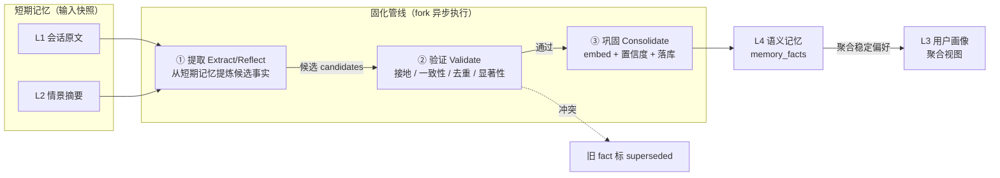
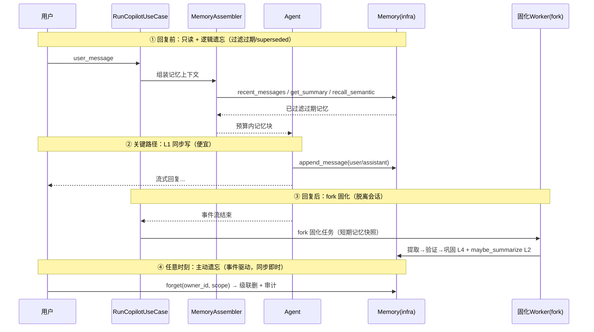

# 记忆系统设计：提取-验证-巩固的固化式分层记忆

- 状态: draft（设计评审中）
- 日期: 2026-06-07
- 关联：[domain/ports.py:MemoryPort](../../domain/ports.py)（接口已定义，待实现）、[domain/models.py:SessionProfile/Fact/Message](../../domain/models.py)、[app/agent/copilot.py](../../app/agent/copilot.py)、[ADR-006 4 层架构](../decisions/ADR-006-4-layer-architecture.md)
- 范围：v2（`api/v2`）记忆能力，从零落地（当前 agent 完全无状态）

---

## 1. 背景与目标

### 现状（审计结论）
- `MemoryPort` 四层接口**已定义**（L1 短期 / L2 摘要 / L3 画像 / L4 语义），但**无 infra 实现、无注入**。
- `TaskRepoPort.list_messages(task_id)` 已落地（[infra/storage/sqlite_task_repo.py](../../infra/storage/sqlite_task_repo.py)），消息已在持久化。
- 断点：[app/agent/copilot.py](../../app/agent/copilot.py) 的 `_build_messages()` 只拼 `[system, 当前 user_message, 观察值]`，**完全不含历史轮次** → agent 失忆。

### 目标
让 agent "记得住、会提炼、该忘则忘"，且**贴合本项目约束**：

| 约束 | 来自项目的事实 | 设计含义 |
|---|---|---|
| 不破坏 DDD | domain/app/infra/api + Ports | 只补 infra 适配器 + app 编排，domain 接口微调 |
| 可选可降级 | `risk_profile`/`research` 均 `Port \| None` | `memory: MemoryPort \| None`，None 退回无状态 |
| owner_id 隔离 | KB/Task 全程按 owner_id 过滤 | 记忆必须同样隔离（合规底线） |
| 复用既有栈 | SQLite TaskRepo + Embedder + Chroma | L1 复用存储、L4 复用 RAG 栈，零重依赖 |
| 合规自洽 | 产品做"数据出境/隐私合规" | 记忆自身满足最小化 + 删除权 + 可解释 |

---

## 2. 核心隐喻：人脑记忆固化（Consolidation）

本设计的灵魂——**长期记忆不是会话里直接写的，而是从短期记忆"固化"出来的**，类比人脑海马体（短期）在睡眠/空闲时把经验迁移、提炼到新皮层（长期）：

| 人脑 | 本系统 | 载体 |
|---|---|---|
| 工作记忆（海马体短期） | **L1 工作记忆**：当前会话原文 | SQLite（复用 TaskRepo） |
| 情景记忆（episode） | **L2 情景记忆**：会话滚动摘要 | SQLite `task_summaries` |
| 语义记忆（新皮层长期） | **L4 语义记忆**：巩固后的事实 | Chroma `memory_facts` |
| 偏好/人格 | **L3 用户画像**：稳定偏好聚合 | SQLite `profiles` |
| 睡眠固化 / 反思 | **固化管线**：提取→验证→巩固（fork 异步） | 后台任务 |
| 遗忘曲线 | **遗忘机制**：主动/被动/容量/冲突 | 见 §6 |

> 区别于 naive 记忆（"对话里 append 一条记忆"），本系统是**fork 出固化进程，从短期记忆提取候选、验证接地与一致性、渐进巩固为长期记忆**——这是核心差异化亮点。

---

## 3. 记忆固化管线：提取 → 验证 → 巩固（旗舰亮点）

长期记忆（L4）的写入**不在会话请求-响应周期内**，而是一条独立的三段式管线：



### ① 提取（Extract / Reflect）
周期性"回想"近期短期记忆，用 LLM 提炼**候选事实**（用户偏好、所属行业、关注法规、已确认的业务事实等）。借鉴 Generative Agents 的 reflection：不是逐句记，而是**提炼高层结论**。

### ② 验证（Validate）——你强调的"还要验证"，防止记忆失真
候选事实进长期库前**必须过四关**，任一不过则丢弃或改写：

| 验证关 | 作用 | 失败处理 |
|---|---|---|
| **接地 Grounding** | 该事实是否真有对话证据支撑 | 无证据 → 判为幻觉记忆，丢弃 |
| **一致性 Consistency** | 是否与已有高置信记忆冲突 | 冲突 → 触发**冲突遗忘**（旧 fact 标 `superseded_by`） |
| **去重 Dedup** | 语义近义是否已存在 | 已存在 → 合并 + 强化置信，不新增 |
| **显著性 Salience** | 重要性是否达阈值 | 低于阈值 → 不固化（防污染） |

### ③ 巩固（Consolidate / Commit）
通过验证的候选 → `Embedder` 向量化 → upsert 到 Chroma `memory_facts`，附带 `confidence` / `salience` / `source_episode` / `created_at`。

### 渐进固化（额外亮点）：记忆会"由弱变强"
像人脑，新记忆脆弱、反复印证才牢固：
- 首次提取：低置信（tentative）
- 多个 episode 重复印证 → 置信度**强化**（reinforcement）
- 长期不被召回/印证 → 置信度**衰减**（被动遗忘）

→ 记忆有连续的"短期→长期"固化曲线，而非非黑即白。

---

## 4. Fork 模型：写入为何脱离会话

**核心原则**：关键路径上只放最便宜的 L1（SQLite insert）；所有带 LLM/embedding 的固化与遗忘，全部 fork 到"会话之外"执行，best-effort，失败不影响主回复。

### 固化任务的触发时机
| 触发 | 类比 | 说明 |
|---|---|---|
| 任务收尾（task close） | 一段经历结束后回想 | 把整个 task 的短期记忆固化 |
| backlog 超阈值（每 N 轮） | 信息积累到一定量 | 增量固化，避免拖到很晚 |
| 空闲时（idle，可选） | 睡眠固化 | 低优先级后台跑 |

### 执行方式（落地选型，按代价递增）
- **A（推荐起步）**：回复发出后，在 use case 生成器尾部 fork 一个**后台线程**跑固化，读短期记忆快照，互不阻塞。
- **B**：固化逻辑从生成器剥离，由 use case 显式调度（不依赖生成器被耗尽，抗断连）。
- **C**：引入真正的任务队列（Celery/RQ）——重，现阶段不上。

固化任务**幂等**（基于 §6 的 watermark + fact dedup），所以"漏跑/重试"都安全 → 即使客户端断连，下一轮 backlog 自愈补上。

---

## 5. 写入时机（分层差异化）

| 层 | 写什么 | 何时写 | 同步/异步 | 关键路径? |
|---|---|---|---|---|
| **L1 工作记忆** | user/assistant 原文 | 每轮消息边界 | 同步（~ms，复用现有写入） | ✅ 在（极便宜） |
| **L2 情景记忆** | 滚动摘要 | 回复后，未摘要数 ≥ 阈值 | 异步（fork） | ❌ |
| **L3 用户画像** | 稳定偏好 | ① ask_user 即时；② 固化时聚合 | 混合 | 部分 |
| **L4 语义记忆** | 巩固后事实 | 固化管线（提取→验证→巩固） | 异步（fork） | ❌ |

### 请求生命周期时间轴


---

## 6. 遗忘机制（四类 + 双层解耦）

朴素记忆只做"加"，工程级记忆必须做"减"：

| 类型 | 解决 | 驱动 | 时机 | 作用层 |
|---|---|---|---|---|
| **主动遗忘** | 被遗忘权 / PIPL §47 | 事件 | 立即（同步）+ 审计 | L1~L4 |
| **被动遗忘** | 存储限制 + 信息失效 | 时间 | 读时过滤即时 + 清扫惰性 | 各层差异 TTL |
| **容量遗忘** | 单用户膨胀 | 写 | L4 巩固后超上限 | L4 |
| **冲突遗忘** | 记忆自相矛盾 | 写 | 验证阶段命中近义旧 fact | L3/L4 |

### 关键设计 ①：逻辑遗忘 vs 物理遗忘解耦
单进程 FastAPI 无 cron，故拆两层：
- **逻辑遗忘（即时、强保证）**：读取时就过滤掉 TTL 过期 / `superseded` 的记忆——**过期记忆永不被注入**，哪怕物理上还在。
- **物理遗忘（惰性、弱保证）**：真正 DELETE 在写入顺手清扫 / 启动时 / 每 N 次扫一遍。删慢无妨，逻辑层已挡住。

### 关键设计 ②：分层差异化保留期（数据最小化落地）
- L1 原文：短 TTL（最敏感，留存最短）
- L2 摘要：中 TTL（用摘要替代原文）
- L3/L4：长留存 + 衰减/冲突淘汰

→ 直接对应 PIPL **存储限制原则**：合规产品对自己记忆做差异化最小化留存。

### 关键设计 ③：衰减打分（被动遗忘 + 渐进强化共用）
```
score = salience · e^(-λ·age) · (1 + log(1 + recall_freq))
```
- 高显著 + 近期 + 常被召回 → 分高，留
- 容量超限时淘汰最低分
- 长期低分 → 进入被动遗忘

### 写入幂等（水位线）
- L2 摘要靠 `msg_watermark`（已摘要到第几条）→ 重试不重复摘要、漏摘自动补。
- L4 靠 `fact_id` + 语义去重 → 重放不双写。

---

## 7. 读取：预算感知编排器（MemoryAssembler）

不是把历史一股脑塞进 prompt，而是在**固定 token 预算**内按优先级择优拼装：

| 层 | 内容 | 预算占比 | 触发 |
|---|---|---|---|
| L1 | 最近 N 轮原文 | ~50% | 总是 |
| L2 | 早期对话摘要 | ~20% | 消息数 > 阈值 |
| L3 | 用户偏好 | ~10% | 有画像时 |
| L4 | query 召回的相关事实 | ~20% | 当前 query 触发 |

预算不够时按 **L1 > L4 > L2 > L3** 降级丢弃，保证当前对话连续性最优先。注入点：[app/agent/copilot.py](../../app/agent/copilot.py) `_build_messages()` 增 `【记忆】` 块。

---

## 8. 技术选型

### 自建 vs 现成库
| 方案 | 劣势 | 契合度 |
|---|---|---|
| Mem0 | 黑盒、自带向量/LLM 抽象，与 Ports 冲突 | 低 |
| Zep / Letta(MemGPT) | 需独立服务、运维重 | 低 |
| LangMem / LangChain memory | 抽象与自研 Ports 重叠 | 低 |
| **自建于现有栈（推荐）** | 需写 4 个 adapter | **高** ✅ |

**结论**：`MemoryPort` 已替我们做完最难的接口设计，现成库反而打架。自建是唯一与架构自洽的选择。

### 各层落地选型
| 层 | 存储 | 算法/模型 |
|---|---|---|
| L1 | 复用 `SqliteTaskRepo`（不建新表） | `list_messages(task_id)[-n:]` |
| L2 | SQLite `task_summaries` | LLM **增量精炼**（非 map-reduce，成本 O(1)/轮） |
| L3 | SQLite `profiles` | `SessionProfile.facts` free-form 起步 |
| L4 | Chroma 独立 collection `memory_facts` | `Embedder`（智谱 embedding-3 / 2048 维）+ owner 过滤 |
| 提取/验证 | — | 轻量 LLM（reflection prompt + 验证 prompt） |

---

## 9. 亮点汇总（六大）

| 维度 | 亮点 |
|---|---|
| 生命周期 | **① 提取-验证-巩固固化管线**（fork 异步 + 接地验证防幻觉 + 渐进强化）⬅ 旗舰 |
| 生命周期 | **② 三位一体遗忘**（主动/被动/容量/冲突 + 逻辑/物理解耦） |
| 读 | ③ 预算感知编排器（分层 + token 预算 + 优先级降级） |
| 架构 | ④ 记忆即检索（L4 复用 RAG 栈，一套向量基建服务知识+记忆） |
| 领域 | ⑤ 合规自洽（最小化留存 + 被遗忘权 + 可解释，与产品主题共振） |
| 工程 | ⑥ 优雅降级 + 零重依赖复用（`memory=None` 退回现状） |

---

## 10. 接口与模型变更

| 变更 | 位置 | 说明 |
|---|---|---|
| `MemoryPort.forget(owner_id, scope)` | [domain/ports.py](../../domain/ports.py) | **新增**：主动遗忘入口（现接口缺） |
| `Fact` 加字段 | [domain/models.py](../../domain/models.py) | `confidence` / `salience` / `last_used_at` / `superseded_by` / `source_episode` |
| `TaskBackedMemory` | `infra/memory/task_memory.py`（新建） | L1 复用 TaskRepo |
| `ConsolidationWorker` | `infra/memory/consolidation.py`（新建） | 提取→验证→巩固 |
| `MemoryAssembler` | `app/memory/assembler.py`（新建） | 预算感知组装 |
| 注入 | `app/container.py` / `app/factories.py` | 仿 `build_research`，`memory: MemoryPort \| None` |
| 配置 | `config.py` | `memory_recent_n` / `memory_token_budget` / `summary_threshold` / TTL / `decay_lambda` / `fact_cap_per_owner` |

---

## 11. owner_id 隔离与合规

- L1~L4 全程按 `owner_id` 隔离（L4 用 Chroma metadata 过滤，与 KB 同机制）。
- **被遗忘权**：`forget(owner_id)` 级联删 SQLite（L1/L2/L3）+ Chroma（L4），写一条 `AuditLogPort` 留痕——**只记"删了什么范围"，不回存被删内容**（审计自身也守最小化）。
- **可解释**：注入的每条记忆可溯源（哪轮 / 哪条 fact / 哪个 episode）。

---

## 12. 渐进落地路线（每步都带"记"与"忘"）

- **S-030a**：L1 注入 + `MemoryAssembler` 骨架 + 注入 Port → **解决失忆**（最小闭环，改动最小价值最高）。
- **S-030b**：L2 滚动摘要 + **被动遗忘**（TTL 差异化留存）。
- **S-030c**：L4 固化管线（提取→验证→巩固）+ **写入门控** + **冲突遗忘** → 记忆即检索 + 不污染 + 会改正。
- **S-030d**：L3 画像 + **主动遗忘**（被遗忘权 + 审计）。

---

## 13. 风险与降级
- **隐私**：默认按 owner_id 隔离；L2 摘要降低原文留存；提供清除入口。
- **成本**：固化/遗忘惰性 fork，不阻塞主回复；提取/验证用轻量 LLM。
- **窗口**：编排器硬上限保证 prompt 不爆。
- **幻觉记忆**：接地验证关拦截无证据候选。
- **断连**：固化幂等 + backlog 自愈，漏一次下一轮补回。
- **回退**：`memory=None` 全链路退回当前无状态行为。

---

## 14. 评审拍板结论

### 14.1 固化 fork：选 **B 显式调度**起步
不挂生成器尾部（SSE 断连/未消费/提前退出会漏跑）。关键路径只同步写 L1；回复完成后由 `RunCopilotUseCase` 显式调 `memory_scheduler.schedule_consolidation(owner_id, task_id)`，只记 watermark，不阻塞主回复；L2/L4 后台 best-effort，失败下一轮按 watermark 自动补。实现：v1 用 `ThreadPoolExecutor` → 后续抽象 `MemoryJobSchedulerPort` → 暂不上 Celery/RQ。

### 14.2 差异化 TTL + 可配置
```bash
MEMORY_L1_TTL_DAYS=30
MEMORY_L2_TTL_DAYS=180
MEMORY_L4_TTL_DAYS=365
MEMORY_DECAY_LAMBDA=0.01
MEMORY_FACT_CAP_PER_OWNER=500
```
| 层 | 保留期 | 理由 |
|---|---|---|
| L1 原文 | 30 天 | 最敏感，最短 |
| L2 摘要 | 180 天 | 低敏，中期 |
| L3 画像 | 无固定 TTL，支持主动清除 | 只存稳定偏好，可解释可删 |
| L4 事实 | 365 天 | 受衰减/容量/冲突约束 |

读取先逻辑过滤（过期/superseded/forgotten 不注入）；物理删除惰性清扫。容量超 `FACT_CAP_PER_OWNER` 按 `score = salience·exp(-λ·age)·(1+log(1+recall))` 淘汰最低分。

### 14.3 写入门控：**规则 + LLM 混合**
两段式：① 规则预过滤（只把明显有长期价值的送检：显式偏好/稳定业务事实/已确认约束/多轮反复主题；滤掉临时问题/闲聊/工具中间结果/未确认假设/敏感身份推断）；② 轻量 LLM 提取结构化候选 → 再过 grounding/consistency/dedup/salience 四关。口诀：**规则管"要不要送检"，LLM 管"如何表达"，验证器管"能不能入库"**。

### 14.4 提取触发：两者都要，分阶段
- 起步：L2 每 N 轮 backlog（`MEMORY_SUMMARY_THRESHOLD=20`）；L4 仅 task close / 显式结束 / 新任务切换。
- 稳定后：未固化数超 `MEMORY_CONSOLIDATION_MIN_BACKLOG=30` 也增量固化；watermark 记进度，重试幂等不重复写 fact。
```bash
MEMORY_SUMMARY_THRESHOLD=20
MEMORY_CONSOLIDATION_MIN_BACKLOG=30
MEMORY_CONSOLIDATE_ON_TASK_CLOSE=true
MEMORY_CONSOLIDATE_ON_IDLE=false
```

### 14.5 L3：表/接口先建，自动抽取推迟
L3 影响面最大，抽错会持续污染。起步只支持两类低风险写入：① 用户显式声明偏好；② 系统配置类偏好。正式画像来自 **L4 已验证 fact 的聚合**，而非直接从原始对话抽：
```text
✅ L1/L2 原始历史 → L4 验证事实 → L3 稳定画像
❌ L1 原始对话 → L3 用户画像
```

### 落地顺序（据上述结论）
1. **S-030a**：L1 短期记忆注入 + `MemoryAssembler` 骨架（不做 L2/L3/L4，不做固化管线）
2. **S-030b**：L2 摘要 + TTL 逻辑遗忘
3. **S-030c**：L4 提取-验证-巩固 + 写入门控 + 冲突遗忘
4. **S-030d**：基于 L4 稳定事实聚合 L3 + 主动遗忘 + 审计
