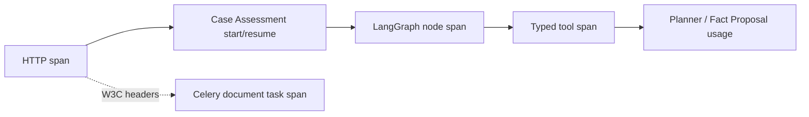

# Phase 8 实施复盘：可观测性与成本

- 状态：已完成
- 日期：2026-08-17
- 前置提交：`83868de`
- 核心边界：Trace/Metric 只负责诊断，`AgentRun`、`RunEvent`、`Audit` 才是业务 SSOT

## 1. 本阶段目标

让 RiskPilot 能用真实运行证据回答四个生产问题：

1. 一次 HTTP 请求慢在哪里；
2. 一个 Case Assessment Run 经过哪些 Graph Node 和 Tool；
3. Celery 文档任务是否继承了上游 Trace，以及重试发生了几次；
4. Planner 和 Fact Proposal 实际消耗多少 input/output token，按哪套显式价格估算成本。

本阶段交付：

- 结构化 JSON 日志；
- HTTP → Agent Run → LangGraph Node → Typed Tool → Celery Task 的 Trace；
- OpenTelemetry SDK 与可选 OTLP HTTP exporter；
- API 与 Celery Worker 的 Prometheus 指标；
- Celery prefork 多进程指标聚合；
- W3C `traceparent` 跨 Celery 消息传播；
- Provider `input_tokens` / `output_tokens` / `total_tokens` 接入；
- `AgentRun.token_usage`、`AgentRun.cost` 和模型价格快照持久化；
- 可选 LangSmith 与 OTel 同时启用时的组合 Trace；
- 默认测试零 collector、零网络、零真实模型、零费用。

## 2. Phase 8 开始前基线

### 2.1 已有资产

- `request_id` / `user_id` ContextVar；
- 纯文本 logging filter；
- 框架无关 `TracePort`；
- Noop/LangSmith Trace Adapter；
- Case Assessment start/resume 顶层 span；
- Deep Research、Copilot、Risk Profile 顶层 span；
- `RunEvent` 已记录 stage/tool duration、retry、token；
- `AgentRun` 已有 `token_usage` 和 `cost` 字段；
- LangSmith 已有客户端白名单、业务 ID HMAC 和输入/输出隐藏。

### 2.2 缺口

1. 日志不是统一 JSON，无法直接按 `run_id/node/tool` 查询；
2. Graph Node 和 Typed Tool 没有独立 span；
3. 没有 OTel Provider、OTLP exporter 和 W3C propagation；
4. 没有 Prometheus endpoint；
5. Celery 消息没有父 Trace，Worker 与上游请求断链；
6. Celery prefork 子进程没有可聚合的 Worker 指标；
7. Planner 与 Fact Proposal 只有 total token 或根本没有 usage；
8. AgentRun 成本恒为 0，且历史 Run 没冻结模型和价格；
9. 原始异常 message 可能被 OTel SDK 自动写入 span event；
10. HTTP 动态资源 ID 可能造成 Prometheus 高基数和 Trace 数据泄漏。

## 3. 核心设计决策

### 3.1 OTel 和 Prometheus 继续走 Port/Adapter

domain 只新增 `MetricsPort`，没有导入 OTel、Prometheus、FastAPI 或 Celery：

```text
domain.ports.TracePort / MetricsPort
        ↑
infra OpenTelemetry / Prometheus Adapter
        ↑
app Container / middleware / workflow composition
```

为什么：

- 默认测试可以注入 Noop/Fake；
- 领域层不感知 collector、exporter 和 metrics backend；
- 未来换 Grafana Alloy、Datadog 或其他 exporter 不改业务规则。

### 3.2 Trace、Metric、业务事件分工

| 记录 | 负责 | 是否业务 SSOT |
| --- | --- | :---: |
| `AgentRun` / `RunEvent` / `Audit` | 状态、审批、不可变审计、恢复 | 是 |
| OTel Trace | 跨组件因果链、节点耗时、错误类型 | 否 |
| Prometheus | 聚合趋势、告警和容量 | 否 |
| LangSmith | 可选且脱敏的 AI 调用诊断 | 否 |

Trace 丢失不能阻止 checkpoint 恢复；Prometheus 丢失不能改变 Assessment 状态。

### 3.3 为什么 `run_id` 明文、其他业务 ID 做 HMAC

- `run_id` 是排障主键，需要运维人员从 Run Detail 定位 Trace；
- `user_id/workspace_id/case_id/task_id/thread_id` 可能暴露组织或业务关系，只保存固定盐
  HMAC；
- HMAC 仍能按同一实体聚合，但不能从 Trace 反推出原 ID。

### 3.4 OTel 采用显式元数据白名单

不能使用“短字符串都安全”的规则。OTel Adapter 只接受：

- 固定字符串：`run_id`、`workflow`、`stage`、`tool`、`http.route` 等；
- 固定数值：duration、token、retry、count、HTTP status 等；
- 固定布尔值：refused、resumed、completed 等；
- HMAC 业务 ID。

未知字段直接丢弃。异常只记录 `error.type`，并显式关闭 OTel SDK 的自动 exception event，
防止异常 message 和 stacktrace 携带案件正文、Authorization 或 Prompt。

### 3.5 HTTP 指标必须使用低基数路由模板

错误设计：

```text
/api/v3/runs/run_123
/api/v3/runs/run_456
```

这会让每个资源 ID 生成一条 time series，也会把 ID 写入 Trace。

当前设计：

```text
/api/v3/runs/{run_id}
```

middleware 在路由解析后，用 `path_params` 重建带 `/api/v3` 前缀的完整模板；404 统一使用
`unmatched`，不把任意攻击路径写成 label。

### 3.6 Celery Trace 放 header，不放业务参数

Celery task 业务签名仍是：

```python
process_document(job_id)
```

W3C `traceparent/tracestate` 写入 Celery headers。Worker 提取父 context 后再创建
`riskpilot.document.process` span。这样 Trace context 不污染任务幂等键、领域模型或数据库。

### 3.7 Celery prefork 指标使用 multiprocess mode

Celery 使用 `--pool=prefork`，每个子进程有独立内存，普通 Registry 会丢失其他进程数据。

实现：

1. `celeryd_init` 在 fork 前清理并创建 `PROMETHEUS_MULTIPROC_DIR`；
2. 子进程 Counter/Histogram/Gauge 写共享 `.db` 文件；
3. 父 Worker 只启动一个 `9101` HTTP server；
4. `MultiProcessCollector` 聚合所有子进程；
5. `worker_process_shutdown` 标记死亡 PID；
6. 队列深度从 Redis `LLEN(celery_queue)` 采样，失败时只跳过指标，不影响任务。

`PROMETHEUS_MULTIPROC_DIR` 只配置给 Worker，不允许 API 进程共用。

### 3.8 成本只按显式价格和显式币种估算

成本公式：

```text
cost =
  input_tokens  × input_price_per_1m
  + output_tokens × output_price_per_1m
  --------------------------------------
                 1,000,000
```

新增：

```text
LLM_INPUT_COST_PER_1M_TOKENS
LLM_OUTPUT_COST_PER_1M_TOKENS
LLM_COST_CURRENCY
```

规则：

- 默认价格为 0，`cost=0` 表示“未配置价格”，不是模型免费；
- 非零价格必须显式配置三位币种，如 `CNY` 或 `USD`；
- Run 冻结模型、provider、input/output 单价和币种；
- 服务端快照覆盖客户端同名值，客户端不能伪造成本依据；
- Prometheus cost metric 包含低基数 `currency` label。

## 4. 链路和数据流

### 4.1 Trace 链路



同一进程通过 OTel current context 自动建立父子关系；跨 Celery 通过 W3C headers 延续
`trace_id`。

### 4.2 Token 和成本流

```text
LangChain AIMessage.usage_metadata
→ ChatResponse / EvidencePlanResult / FactProposalResult
→ ToolExecutionResult / AgentBudget
→ LangGraph checkpoint 轻量 budget
→ AssessmentRunUseCase
→ AgentRun.token_usage + AgentRun.cost + model_config_snapshot
→ Prometheus token/cost counters
```

模型回答正文不会因为 usage 接入而进入 Run、Metric 或 Trace。

## 5. 修改文件：为什么改、怎么实现

### 5.1 依赖和配置

| 文件 | 为什么改 | 怎么实现 |
| --- | --- | --- |
| `requirements.txt` | 原项目没有标准 Trace/Metric SDK | 增加 OTel API/SDK、OTLP HTTP exporter 和 `prometheus-client`；不加入 collector 服务依赖 |
| `config.py` | 可观测性和成本必须显式配置且启动时校验 | 增加 OTel、JSON log、Prometheus、Worker 端口、token 单价和币种；OTel 启用但无 endpoint、非零价格但无币种时 fail-fast |
| `.env.example` | 面试官需要知道哪些配置默认联网、哪些默认安全关闭 | 给出 OTel/Prometheus/价格示例；明确 multiprocess 目录只属于 Worker |
| `docker-compose.yml` | Worker 指标必须真实可抓取 | Worker 配置 multiprocess 目录并暴露 `9101`；Phase 9 再做完整容器启动验收 |

### 5.2 Domain 与轻量上下文

| 文件 | 为什么改 | 怎么实现 |
| --- | --- | --- |
| `domain/ports.py` | app/infra 需要框架无关指标边界 | 新增 `MetricsPort`，覆盖 HTTP、Agent、Tool、Worker、队列、LLM usage、Citation failure 和 render |
| `domain/__init__.py` | 保持 domain 公共导入风格 | 导出 `MetricsPort` |
| `domain/models.py` | Chat Adapter 必须返回真实 input/output/total token | `ChatResponse` 新增三类 usage，并校验 total 不小于 input+output |
| `domain/facts.py` | Fact Proposal 是真实模型调用，不能只统计 Planner | `FactProposalResult` 新增三类 usage 和一致性校验 |
| `domain/agent_workflow.py` | Graph budget 需要分别累计 input/output token | `EvidencePlanResult`、`ToolExecutionResult`、`AgentBudget` 增加 usage；`consume_tokens()` 做预算和一致性校验 |
| `observability_context.py` | infra 不能反向导入 `app.request_context` | 新增纯 stdlib 中立 ContextVar 模块，保存 run/workspace/case/node/tool；不依赖 domain/app/infra |
| `app/request_context.py` | 保持旧 API 兼容，同时组合 HTTP 用户上下文和运行时上下文 | 继续管理 request/user；从中立模块重导出 `observability_context`，原测试和调用方不必迁移 |

### 5.3 JSON Log、OTel 和 Prometheus

| 文件 | 为什么改 | 怎么实现 |
| --- | --- | --- |
| `app/logging_setup.py` | 文本日志难查询且可能泄漏参数 | 增加 `JsonLogFormatter`；输出 request/trace/span/run/node/tool；业务 ID HMAC；extra 只允许安全标量；不插值 `record.args`；Authorization/Cookie/API Key/Password/Secret/Prompt 脱敏 |
| `infra/observability/otel.py` | 需要标准 Trace、可选导出和跨进程传播 | 独立 `TracerProvider`、ratio sampler、可选 OTLP exporter、Composite Adapter、W3C inject/extract/attach；白名单 attribute；异常只保留类型 |
| `infra/observability/metrics.py` | 需要低耦合 Prometheus 指标 | 实现 Noop/Prometheus Adapter；API 使用私有 Registry；Worker 检测 multiprocess 目录后聚合；cost 带币种 |
| `infra/observability/__init__.py` | 统一 composition root 导入 | 导出 OTel、Metrics、propagation 辅助函数 |
| `app/observability_middleware.py` | HTTP span/latency 不能散落在 route | 统一创建 HTTP span 和 metric；成功/异常都记录；动态 path 转路由模板；404 用 `unmatched` |
| `api/v2/metrics.py` | Prometheus 需要稳定抓取入口 | 新增 `GET /api/v2/metrics`，使用 Adapter content type，不进入 OpenAPI |
| `api/v2/router.py` | 让 production/test app 共用同一 endpoint | 挂载 metrics 子路由 |
| `main.py` | 生产入口必须真正启用日志/middleware并释放 Provider | 按 Settings 配 JSON log，安装 HTTP observability middleware，shutdown 时关闭 Trace Provider |

### 5.4 Planner、Fact Proposal 和 Tool Registry

| 文件 | 为什么改 | 怎么实现 |
| --- | --- | --- |
| `infra/chat/openai_chat.py` | OpenAI-compatible Provider 的 usage 在 `AIMessage.usage_metadata` | 解析 input/output/total；异常或缺失值安全回退 0 |
| `tests/fakes/fake_chat.py` | 离线测试需要可控 usage | 支持分别注入 input/output/total token，不访问模型 |
| `infra/agents/evidence_planner.py` | EvidencePlan 是模型调用，需把 raw usage 返回 Graph | 从 LangChain structured output 的 raw `AIMessage` 解析 usage |
| `infra/qa/fact_proposals.py` | Fact Proposal 不能漏记成本 | 把 `ChatResponse` usage 透传到 `FactProposalResult` |
| `app/use_cases/fact_management.py` | Tool executor 需要拿到 Fact Proposal usage | `FactProposalBatch` 增加 input/output/total token |
| `app/agent_tools/case_assessment.py` | Fact Tool 输出要把 usage 交给 Registry，但不能暴露到业务 payload | `ExtractFactCandidatesOutput` 增加 `exclude=True` usage 字段；Registry builder 接收模型和价格 |
| `app/agent_tools/registry.py` | 工具耗时、重试和模型 usage 是 Agent 可观测性核心 | 每个 Tool 建 span 和 metrics；注入 run/node/tool ContextVar；校验后提取 usage；按显式价格估算；仍执行 Tool Policy 和 Pydantic 复核 |

### 5.5 Case Assessment Graph 和 Run

| 文件 | 为什么改 | 怎么实现 |
| --- | --- | --- |
| `infra/workflows/case_assessment_graph.py` | 只看 start/resume 无法定位慢节点 | 统一 `_node()` 包装 16 个节点，记录 node span、状态和耗时；Planner usage 进入 budget/metric；Citation 失败计数；Tool usage 进入 input/output/total budget |
| `infra/workflows/langgraph_runtime.py` | 一次 start/resume 需要 Agent 级 duration/status/refusal metric | 注入 Metrics；成功/失败均记录；从轻量 budget 读取 token；不把正文写入 span |
| `app/use_cases/assessment_runs.py` | `AgentRun.cost` 原来恒为 0，历史成本不可复算 | 从 Graph budget 读取真实 usage；按服务端 Settings 估算并单调持久化；冻结 model/provider/input price/output price/currency |
| `app/factories.py` | composition root 要统一决定 Adapter、模型和价格 | 构造 Composite Trace、Prometheus/Noop Metrics；把 trace/metrics/model/price 注入 Runtime 和 Registry |
| `app/container.py` | API、Agent、Tool、Use Case 必须共享同一实例 | 保存 `self.trace/self.metrics`；注入风险模型、Tool Registry、Workflow Runtime、AssessmentRunUseCase |

### 5.6 Celery Worker

| 文件 | 为什么改 | 怎么实现 |
| --- | --- | --- |
| `infra/tasks/celery_dispatcher.py` | API 投递任务时需要延续当前 Trace | `send_task(headers=inject_trace_headers())`；业务 args 仍只有 `job_id` |
| `infra/tasks/runtime.py` | Worker composition root 需要独立 Trace/Metrics 生命周期 | `WorkerRuntime` 持有 trace/metrics，关闭时 shutdown Provider |
| `infra/tasks/document_tasks.py` | Worker 任务缺少父 Trace、耗时、重试和队列采样 | 提取 headers、attach 父 context、建 task span；记录 completed/retrying/failed/幂等 outcome；任务前后采样队列 |
| `infra/tasks/worker_observability.py` | prefork 子进程指标不能靠单进程 Registry | Celery signals 管理 multiprocess 目录、父进程 HTTP server、死亡 PID；Redis `LLEN` 采样队列，故障静默降级 |

### 5.7 API、文档和路线

| 文件 | 为什么改 | 怎么实现 |
| --- | --- | --- |
| `tests/api/conftest.py` | 测试 app 也要经过真实 HTTP middleware | 安装 observability middleware，继续注入全 Fake Container |
| `Makefile`、`.github/workflows/ci.yml` | 中立 ContextVar 模块不能逃逸类型门禁 | mypy 从 `domain app infra` 扩展为同时检查 `observability_context.py` |
| `README.md` | 对外首屏必须说明真实可观测性，不能只宣传 LangSmith | 增加 OTel、Prometheus、token/cost 边界；不提前宣称 Phase 9 完成 |
| `docs/roadmap/autumn-recruitment-production-plan.md` | 路线必须与实施状态一致 | Phase 0～8 完成，下一阶段改为 Phase 9 |
| `docs/implementation/phase-08-observability-and-cost.md` | 用户要求每阶段可复习 | 记录本文件中的设计、逐文件实现、命令证据和风险 |

### 5.8 测试文件

| 文件 | 验证内容 |
| --- | --- |
| `tests/infra/test_otel_observability.py` | 父子 span、W3C propagation、ID HMAC、未知字段丢弃、异常正文不进 event |
| `tests/infra/test_prometheus_metrics.py` | 所有 Phase 8 metric family、token/cost/currency、Noop 协议 |
| `tests/infra/test_worker_observability.py` | multiprocess 目录、单例 exporter、PID 清理、Redis 队列采样与降级 |
| `tests/api/test_metrics.py` | endpoint、content type、OpenAPI 隐藏、动态路由模板、404 固定 label |
| `tests/app/test_logging_setup.py` | JSON 可解析、HMAC ID、run/node/tool、敏感字段和日志参数不泄漏 |
| `tests/infra/test_celery_tasks.py` | Dispatcher 注入真实 `traceparent`，保留 task id 与 cooperative revoke |
| `tests/infra/test_langgraph_runtime.py` | 节点 span、Planner usage、token budget、Prometheus 显式成本 |
| `tests/app/test_typed_tool_registry.py` | Tool span/usage/cost 经过真实 Registry，而非直接测 Adapter |
| `tests/app/test_assessment_runs.py` | AgentRun 真实 token/cost、价格快照、客户端不能覆盖、零价格不伪造 |
| `tests/test_config_chat_override.py` | 非零价格必须指定币种，零价格保持离线默认 |

## 6. 数据模型变化

### 6.1 没有数据库 Migration

本阶段复用已有：

- `AgentRun.token_usage`；
- `AgentRun.cost`；
- `AgentRun.model_config_snapshot`；
- `RunEvent.payload`。

因此没有新增表或列，也没有 Alembic migration。

### 6.2 结构化模型变化

新增或增强：

```text
ChatResponse
EvidencePlanResult
FactProposalResult
ToolExecutionResult
AgentBudget
FactProposalBatch
```

共同支持：

```text
input_tokens >= 0
output_tokens >= 0
token_usage >= input_tokens + output_tokens
```

`AgentRun.model_config_snapshot` 服务端新增：

```json
{
  "model": "实际配置模型",
  "provider": "api|local",
  "input_cost_per_1m_tokens": 0,
  "output_cost_per_1m_tokens": 0,
  "cost_currency": "unspecified|CNY|USD"
}
```

## 7. API 变化

新增：

```text
GET /api/v2/metrics
```

设计：

- 不鉴权，供集群内 Prometheus 抓取；
- 不进入 OpenAPI；
- 使用低基数路由 label；
- 生产部署应通过网络策略限制公网访问，Phase 9 继续处理部署边界。

现有 Case/Document/Agent API 请求和响应保持兼容。

## 8. Agent 状态变化

Graph stage、interrupt kind 和业务状态机没有变化。

新增轻量 budget 字段：

```text
budget.input_tokens
budget.output_tokens
budget.token_usage
```

Checkpoint 仍不保存：

- 文档正文；
- 原始 Prompt；
- 模型回答；
- Authorization/Cookie/API Key；
- Chain of Thought。

每个 Node/Tool 执行期间通过 ContextVar 暂存 `run_id/node/tool`，离开 context 后自动 reset，
不作为业务状态持久化。

## 9. Prometheus 指标

| 指标 | 关键 label | 含义 |
| --- | --- | --- |
| `riskpilot_http_requests_total` | method/route/status | HTTP 请求数 |
| `riskpilot_http_request_duration_seconds` | method/route | HTTP latency histogram |
| `riskpilot_agent_runs_total` | workflow/status | start/resume 执行段 |
| `riskpilot_agent_run_duration_seconds` | workflow | Agent 执行耗时 |
| `riskpilot_agent_refusals_total` | workflow | 安全拒答次数 |
| `riskpilot_tool_calls_total` | tool/status | Tool 成功/失败 |
| `riskpilot_tool_duration_seconds` | tool | Tool latency |
| `riskpilot_tool_retries_total` | tool | Tool retry |
| `riskpilot_worker_tasks_total` | task/status | Celery outcome |
| `riskpilot_worker_task_duration_seconds` | task | Worker latency |
| `riskpilot_worker_task_retries_total` | task | Worker retry |
| `riskpilot_worker_queue_depth` | queue | Redis queue depth |
| `riskpilot_llm_tokens_total` | operation/model/token_type | input/output token |
| `riskpilot_llm_estimated_cost_total` | operation/model/currency | 显式价格估算成本 |
| `riskpilot_citation_verification_failures_total` | workflow | Citation 门禁失败 |

不把 `run_id/case_id/workspace_id/user_id` 放进 Prometheus label，避免高基数。

## 10. 当前测试证据

### 10.1 Phase 8 专项全集

```text
128 passed, 5 warnings in 3.65s
```

覆盖 OTel、Prometheus、Worker exporter、Celery、JSON log、Tool Registry、Agent Run、
LangGraph、Planner、Fact Proposal、Container 和 V3 Assessment API。

### 10.2 导入顺序与币种回归

修复 infra 反向导入 app 的循环后：

```text
89 passed, 5 warnings in 10.65s
```

并显式验证：

```text
from infra.workflows import LangGraphWorkflowRuntime
from app.request_context import observability_context
```

两种导入顺序均可用。

### 10.3 静态门禁

```text
Ruff: All checks passed
mypy: Success: no issues found in 150 source files
```

### 10.4 Prometheus multiprocess 真实 smoke

独立 Python 进程设置临时 `PROMETHEUS_MULTIPROC_DIR`，写 Worker task/retry 指标后再从
`MultiProcessCollector` 读回：

```text
multiprocess metrics smoke: ok
```

### 10.5 Compose 配置

本机只有兼容命令 `docker-compose`，执行：

```text
docker-compose config: ok
```

生成配置确认：

```text
PROMETHEUS_ENABLED=true
PROMETHEUS_MULTIPROC_DIR=/tmp/riskpilot-prometheus
PROMETHEUS_WORKER_PORT=9101
published worker port=9101
```

### 10.6 最终全量

```text
$ PATH="$PWD/.venv/bin:$PATH" make ci
Ruff: All checks passed
Format: 422 files already formatted
mypy: Success: no issues found in 150 source files
pytest: 1344 passed, 4 skipped, 5 warnings in 23.90s
Offline Agent Eval: 39 cases / 13 categories / PASS
```

本次 Offline Agent Eval：

- task/stage/tool/tool-argument/missing-fact/citation/recovery = `1.0`；
- unsupported false accept / unsafe action / cross-tenant leakage = `0.0`；
- average tool calls = `3.307692`；
- average tokens/cost = `0`，原因是 Deterministic/Fake 协议，不代表真实模型免费；
- 本机单次 p50/p95 = `20.22ms / 32.45ms`，不作为生产 SLA。

## 11. 尚未解决的风险

1. OTLP collector 没在本阶段加入 Compose；OTel exporter 配置和离线 in-memory exporter 已
   验证，真实 collector 联调留给 Phase 9；
2. `/api/v2/metrics` 当前依赖部署网络边界，不提供业务鉴权；Phase 9 应只暴露给内网或
   Prometheus network；
3. Worker queue depth 使用 Redis list `LLEN`，适用于当前 Celery Redis transport；更换
   broker 后需要对应 Adapter；
4. Provider 没有返回 usage 时 token/cost 安全回退 0，不能把 0 解释为实际零消耗；
5. 显式价格是部署配置，不会自动追踪供应商调价；Run 已冻结当时价格，更新价格只影响新 Run；
6. OTel 当前只接 traces，没有使用 OTel Metrics；聚合指标统一走 Prometheus，避免两套
   Metrics backend 重复；
7. 本阶段只做后端链路，Run Detail 前端展示属于 Phase 10；
8. `docker-compose config` 只证明配置有效，不证明新机容器启动和数据重启恢复，不能提前
   宣称 Phase 9 完成。

## 12. 验收标准

- [x] 日志是可解析 JSON，包含 request/trace/run/node/tool；
- [x] 日志业务 ID HMAC，敏感参数不插值，已知凭证模式脱敏；
- [x] Trace 元数据白名单，不记录异常 message/stack event；
- [x] HTTP → Agent → Node → Tool 可以按 trace_id 关联；
- [x] Celery headers 传播 W3C trace context；
- [x] API `/api/v2/metrics` 输出 Prometheus 文本；
- [x] Celery prefork Worker 指标可通过独立 `9101` 聚合；
- [x] HTTP、Agent、Tool、Worker、Queue、LLM、Refusal、Citation 指标存在；
- [x] AgentRun 保存真实 token 和按显式价格估算的 cost；
- [x] Run 冻结模型、provider、价格和币种；
- [x] 未配置价格时 cost 保持 0，不伪造费用；
- [x] OTel/LangSmith 默认关闭且离线测试不联网；
- [x] 最终全量 `make ci` 通过并回填真实数字。

## 13. 下一阶段

Phase 8 全量门禁通过后进入 Phase 9：

1. API/Worker 共用同一镜像、不同命令；
2. migration、seed-demo、healthcheck、非 root 和 graceful shutdown；
3. PostgreSQL/Redis/MinIO/Worker/API 真实容器启动；
4. 服务和数据卷重启恢复；
5. 新机器只依赖 Docker 的固定 Demo 验收；
6. 将 OTel collector/Prometheus 作为可选 profile 接入，而不是阻塞核心启动。
