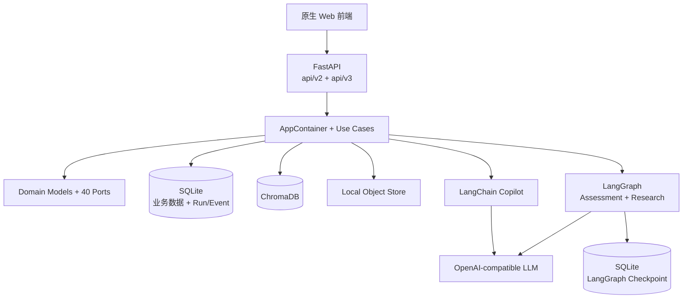
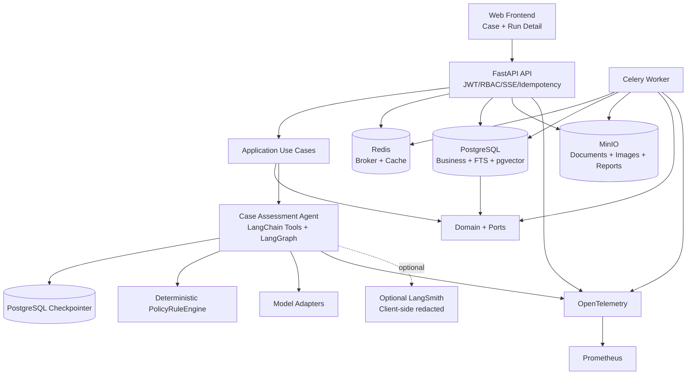

# RiskPilot 2026 秋招生产化路线

- 状态：执行中
- 基线日期：2026-08-17
- 基线提交：`50272310957467bb21eee8d7ca525e4b3ac71c6c`
- 主分支：`main`
- 目标：把现有证据驱动合规系统收敛为一个可运行、可恢复、可评测、可观测的核心案件智能体

## 1. 为什么先写路线

RiskPilot 已经具备 DDD、LangChain、LangGraph、Evidence QA、长期记忆、图片召回、
规则引擎和大量测试。如果继续按“再增加一个 AI 能力”的方式迭代，项目会出现三个问题：

1. 面试叙事发散，无法在几分钟内回答“Agent 到底在哪里”；
2. SQLite、线程池和单体容器不足以证明生产后端能力；
3. 功能很多但缺少统一 Agent 轨迹评测、任务恢复和一键部署证据。

因此本轮不以功能数量为目标，而以一条可信业务闭环为目标。每一阶段必须先设计、再做
最小闭环、再测试、再写复盘；没有证据的性能和效果指标不得进入 README。

## 2. 唯一核心产品定位

> 面向企业数据出境合规场景的证据驱动案件智能体。Agent 能根据案件材料自主制定证据
> 计划，调用文档、法规、事实和规则工具，识别证据缺口和冲突，在关键节点请求人工
> 确认，最终生成带有不可变引用和审计记录的合规评估。

唯一核心业务闭环：

```text
创建案件
→ 上传案件材料
→ 异步解析、OCR、切块和索引
→ Agent 制定证据收集计划
→ 调用案件文档、法规、事实和规则工具
→ 提取候选事实
→ 检测事实缺失和证据冲突
→ 必要时暂停并请求用户或 Reviewer 确认
→ 从 checkpoint 恢复
→ 确定性规则引擎计算合规路径
→ Agent 生成风险说明和整改建议
→ Claim-Citation 校验
→ Reviewer 审批
→ 冻结不可变 Assessment
→ 保留完整 Run、Event、Trace 和 Audit
```

### 2.1 主线和辅助模块

| 层级 | 能力 | 项目叙事 |
| --- | --- | --- |
| 唯一主线 | Case Assessment Agent | 证明规划、工具、状态、HITL、恢复、规则边界和正式产物 |
| 受限子图 | Deep Research | 只在案件证据不足时补充监管研究，不取代主 Agent |
| 辅助入口 | Copilot / Evidence QA | 快速问答和解释，不生成正式 Assessment |
| 辅助记忆 | 分层 Memory | 改善连续使用体验，不参与确定性法规门槛 |
| 辅助检索 | Visual Evidence | 补充图片证据检索，当前不进入正式引用闭包 |

任何新能力都必须回答：它是否让核心案件闭环更可靠、更可恢复或更可解释。不能回答则
不进入 P0。

## 3. 当前基线

### 3.1 Git 与规模

| 项目 | 当前值 | 证据命令 |
| --- | --- | --- |
| HEAD | `50272310957467bb21eee8d7ca525e4b3ac71c6c` | `git rev-parse HEAD` |
| 工作区 | Phase 0 开始时干净 | `git status --short` |
| 相对远端 | 本地 `main` ahead 2 | `git rev-list --left-right --count @{upstream}...HEAD` |
| Domain Port | 40 | `rg '^class .*\\(Protocol\\)' domain/ports.py` |
| Use Case | 17 | AST 统计 `app/use_cases` |
| API 路由声明 | 76 | `rg '@router\\.(get|post|put|patch|delete)' api/v2 api/v3` |
| 测试文件 | 107 | `find tests -name 'test_*.py' -o -name 'smoke_*.py'` |

### 3.2 测试基线

带 CI 假配置的完整离线测试：

```text
1208 passed, 1 skipped, 68 warnings in 41.13s
```

当前裸零密钥问题：

```text
$ env -u OPENAI_API_KEY -u CHAT_API_KEY \
    -u LLM_PROVIDER -u EMBED_PROVIDER \
    .venv/bin/python -c 'import config'

RuntimeError: OPENAI_API_KEY 未配置
```

这说明配置校验发生在模块 import 阶段，导致 pytest 收集依赖真实配置。该问题是 Phase 1
的第一个 P0 门禁，Phase 0 不修改行为。

### 3.3 当前架构



当前优点：

- 领域层不依赖 FastAPI、LangGraph 或数据库；
- Repository、对象存储、检索、模型和 Trace 都有 Port/Adapter 边界；
- Case、Document、Fact、Policy、Assessment、Run/Event 已是一等业务对象；
- 已有 interrupt/resume、乐观锁、不可变引用和 Claim-Citation 验证基础。

当前生产缺口：

- 配置 import 与真实密钥耦合；
- CI 仍是 scoped Ruff，format/mypy 未形成全量门禁；
- 核心业务存储仍是 SQLite；
- 文档处理仍在 API 进程或线程池；
- 本地目录无法被独立 Worker 共享；
- Assessment Graph 仍是确定性骨架，Evidence Plan 和 Typed Tool Registry 未进入图；
- 没有完整 Agent 轨迹评测、OpenTelemetry、Prometheus 和生产 Compose。

## 4. 目标架构



### 4.1 目标职责边界

| 组件 | 负责 | 不负责 |
| --- | --- | --- |
| LangGraph | 决策、状态、节点路由、interrupt/resume | 业务事实存储、后台任务队列 |
| Celery | OCR/Embedding/索引/导出等耗时任务、重试、超时 | Agent 推理状态机 |
| PostgreSQL | 事务、约束、并发、业务查询、pgvector | 原始文件字节 |
| MinIO | 原始文档、图片、导出报告 | 业务状态和权限 |
| LLM | 规划、提取、解释、草拟 | 权限、门槛、审批、状态转换 |
| PolicyRuleEngine | 可复现法规门槛计算 | 自由语言解释和工具选择 |
| LangSmith | 可选且脱敏的 AI Trace | 业务审计 SSOT、案件正文 |

## 5. 不可破坏的原则

1. 依赖方向保持 `api → app → domain`、`infra → domain ports`；
2. SQLAlchemy Model、Celery Task、LangGraph State 不得进入 domain；
3. workspace/case/actor 由服务端运行时注入，模型不能声明权限范围；
4. Citation、Fact 和模型结构化输出必须由服务端重读原文并校验；
5. Reviewer/Admin 负责关键事实和 Assessment 审批，Agent 永远不能自批；
6. Checkpoint 只保存 ID 和轻量状态，不保存正文、凭证或思维链；
7. 默认测试零密钥、零网络、零模型下载和零费用；
8. 每个阶段必须有独立验收证据和实施复盘 Markdown。

## 6. 阶段路线与门禁

| Phase | 目标 | 最小交付 | 进入下一阶段门禁 |
| --- | --- | --- | --- |
| 0 | 冻结基线和收敛主线 | 路线、架构图、5 ADR、复盘规范 | 不改行为；原测试保持 `1208/1` |
| 1 | 开发体验和 CI | 零密钥 pytest、全量 Ruff/format/mypy、health | 裸 `pytest` 通过；CI 全绿 |
| 2 | PostgreSQL 核心存储 | SQLAlchemy/Alembic、核心 Repo、乐观锁 | SQLite/Postgres 双 profile；并发 Run 唯一 |
| 3 | pgvector 和对象存储 | pgvector、S3/MinIO Adapter | 租户过滤下推；独立 Worker 可读文件 |
| 4 | Celery 任务系统 | Redis/Celery、解析索引任务、幂等重试 | API 只返回 202；重复消费不重复写 |
| 5 | 核心 Agent Graph | EvidencePlan、Typed Tools、HITL、预算 | Happy/HITL/恢复三路径通过 |
| 6 | 安全与权限 | Tool Policy、SSRF/注入/越权测试 | 跨租户泄漏与 unsafe action 为 0 |
| 7 | Agent 评测 | 30～50 版本化案件、轨迹指标 | CI 跑离线协议评测，报告可复现 |
| 8 | 可观测性和成本 | JSON Log、OTel、Prometheus、usage/cost | run_id 可串完整链路且无正文泄漏 |
| 9 | Compose 和部署 | api/worker/postgres/redis/minio | 新机器只用 Docker 可跑 seed Demo |
| 10 | Run Detail 和面试材料 | 时间线、工具、HITL、成本、三 Demo | 2～3 分钟固定演示可重复 |

## 7. P0 / P1 / P2

### P0：核心可信闭环

- 零密钥测试与全量 CI；
- README 主线收敛；
- PostgreSQL；
- Celery；
- Case Assessment Agent Graph；
- Agent Eval；
- Docker Compose。

### P1：生产可诊断和共享基础设施

- pgvector；
- MinIO；
- OpenTelemetry；
- Prometheus；
- 安全测试；
- Run Detail。

### P2：有时间再做

- MCP Server；
- Grafana Dashboard；
- 公网部署；
- Outbox Pattern；
- 更完整的前端。

P2 不得抢占 P0。当前已有多模态、Memory 和 Research 只维护、不扩张，直到主线门禁完成。

## 8. 明确非目标

本轮不做：

- 训练大模型；
- 自由 Multi-Agent；
- Agent 自动审批或自动提交监管材料；
- 完整企业 IAM、复杂计费或 Kubernetes Operator；
- 全量前端重写；
- 同时维护多个生产向量数据库；
- Kafka、Temporal、Elasticsearch 等当前闭环不需要的组件；
- 以无真实运行证据的指标包装 README。

## 9. 文档和复盘规则

每个 Phase 必须新增或更新 `docs/implementation/phase-XX-*.md`，至少包含：

1. 本阶段目标；
2. 为什么这样设计；
3. 修改文件及逐文件实现说明；
4. 数据模型变化；
5. API 变化；
6. Agent 状态变化；
7. 测试命令和原始结果；
8. 尚未解决的风险；
9. 下一阶段建议；
10. 验收标准逐项判断。

涉及不可逆技术选择时，另写 ADR。文档必须与代码同一阶段更新，不允许最后补写一篇
泛化总结。后续复习时应先读 Phase 文档理解动机，再读 ADR 理解取舍，最后进入代码。

## 10. README 收敛目标

最终 README 首屏只突出：

1. 一句话产品定位；
2. 核心 Case Assessment 闭环；
3. Agent 的规划、工具、HITL/恢复；
4. 后端的 PostgreSQL/Celery/对象存储/可观测性；
5. 一键启动；
6. 真实测试和 Agent Eval 指标。

Copilot、Memory、Visual、Research 放到“辅助能力”，不与主线并列占据首屏。
